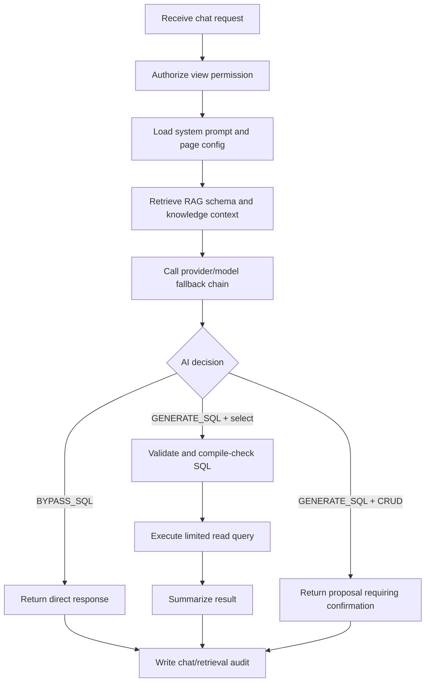

# BS-AI-Assistant Implementation Plan

Last updated: 2026-06-30

This document describes the current implementation plan and shipped architecture for `BS-AI-Assistant`. It replaces the older draft plan that still referred to pre-implementation table names and undecided runtime details.

## Current Status

The AI Assistant is implemented as an ASP.NET Core Web API under `BS-AI-Assistant/AiAssistant`. It is no longer just a proposed chat endpoint. The current service includes page-aware chat, RAG retrieval, provider/model configuration, favorite prompts, CRUD proposal confirmation, AI admin tooling, and dashboard generation.

## Goals

1. Provide an AI chat assistant for MyInventory pages using the current `process` path as context.
2. Use database-managed prompts and page configuration instead of hard-coded prompt text.
3. Retrieve schema and business knowledge through RAG before calling the AI provider.
4. Allow safe read-only SQL reporting from natural language questions.
5. Support explicit two-step CRUD: AI proposes, user confirms, server executes.
6. Keep provider/model/embedding configuration editable from the AI admin console.
7. Keep all AI actions auditable through chat, CRUD, and retrieval logs.
8. Route frontend traffic through the existing API Gateway.

## Implemented Runtime Shape

```text
BS-AI-Assistant/
  Dockerfile
  README.md
  docs/
    implementation_plan.md
  AiAssistant/
    AiAssistant.csproj
    AiAssistant.sln
    Program.cs
    appsettings.json
    appsettings.Development.json
    Controllers/
      AiChatController.cs
      AiKnowledgeController.cs
      AiDashboardController.cs
    Models/
      Entities/
      Requests/
      Responses/
    Services/
      Interfaces/
      Implementation/
    SQL/
```

Frontend integration lives in `BS-Web/Frontend-Core`:

- `src/components/AiChatPopover.js`
- `src/pages/AI/AIAdminConsole.js`
- `src/config/aiMenu.js`
- `src/pages/Dashboard/ForecastDashboard.js`
- `src/pages/Dashboard/DashboardAI.js`

Gateway integration lives in `BS-API-Secure/ApiGateway/ocelot.json`.

## API Surface

### Chat and Admin API

Base route: `/api/ai`

| Method | Endpoint | Status | Purpose |
| --- | --- | --- | --- |
| `POST` | `/chat` | Implemented | Main page-aware AI chat endpoint. |
| `POST` | `/confirm` | Implemented | Confirm and execute AI CRUD proposal. |
| `POST` | `/reject` | Implemented | Reject AI CRUD proposal. |
| `POST` | `/suggestions` | Implemented | Generate quick-pick questions. |
| `GET` | `/favorite-prompts` | Implemented | List user favorite prompts by process. |
| `POST` | `/favorite-prompts/toggle` | Implemented | Toggle favorite prompt state. |
| `GET` | `/health` | Implemented | Service health check. |
| `GET` | `/active-configs` | Implemented | List active AI-enabled page configs. |
| `GET` | `/rate-limit` | Implemented | OpenRouter usage/rate-limit details. |
| `GET` | `/provider-config` | Implemented | Return active provider config. |
| `POST` | `/config/refresh` | Implemented | Clear provider config cache. |
| `GET` | `/overview-stats` | Implemented | AI admin overview metrics. |

### Knowledge API

Base route: `/api/ai/knowledge`

| Method | Endpoint | Status | Purpose |
| --- | --- | --- | --- |
| `POST` | `/documents` | Implemented | Create a knowledge document and optionally chunk it. |
| `GET` | `/documents` | Implemented | List knowledge documents. |
| `POST` | `/documents/{documentId}/chunks` | Implemented | Build chunks for one document. |
| `POST` | `/rebuild-chunks` | Implemented | Rebuild chunks for all or one document. |
| `POST` | `/rebuild-embeddings` | Implemented | Rebuild chunk embeddings. |
| `POST` | `/sync-schema` | Implemented | Sync SQL Server schema metadata into AI tables. |
| `GET` | `/schema-catalog` | Implemented | Preview schema catalog rows. |
| `GET` | `/retrieval-preview` | Implemented | Preview RAG context without calling the LLM. |

### Dashboard API

Controller route: `/api/AiDashboard`

| Method | Endpoint | Gateway alias | Status |
| --- | --- | --- | --- |
| `POST` | `/generate-forecast` | `/gateway/v1/api/dashboard/generate-forecast` | Implemented |
| `POST` | `/auto-generate` | `/gateway/v1/api/dashboard/auto-generate` | Implemented |

## Gateway Plan

Current Ocelot route:

```text
/gateway/v1/api/ai/{everything}
  -> bs_ai_assistance:8080/api/ai/{everything}
```

Dashboard aliases:

```text
/gateway/v1/api/dashboard/generate-forecast
  -> bs_ai_assistance:8080/api/AiDashboard/generate-forecast

/gateway/v1/api/dashboard/auto-generate
  -> bs_ai_assistance:8080/api/AiDashboard/auto-generate
```

All current AI gateway routes require Bearer authentication.

## Database Plan

The implemented schema uses `ais`, not the old draft `t_ais_*` table names.

Core tables:

- `ais.t_ai_system_prompt`
- `ais.t_ai_page_config`
- `ais.t_ai_chat_log`
- `ais.t_ai_crud_audit_log`
- `ais.t_ai_provider_config`
- `ais.t_ai_model_priority`
- `ais.t_ai_favorite_prompts`
- `ais.t_ai_embedding_provider_config`
- `ais.t_ai_knowledge_document`
- `ais.t_ai_knowledge_chunk`
- `ais.t_ai_knowledge_chunk_token`
- `ais.t_ai_schema_catalog`
- `ais.t_ai_schema_relation`
- `ais.t_ai_knowledge_retrieval_log`

Important views and sync sources:

- `ais.v_ai_schema_metadata_source`
- `ais.v_ai_schema_relation_source`

SQL scripts live in `BS-AI-Assistant/AiAssistant/SQL`.

## Provider Configuration Plan

Chat provider configuration:

1. Load active provider from `ais.t_ai_provider_config`.
2. Load active model priorities from `ais.t_ai_model_priority`.
3. Decrypt `api_key` server-side using the configured secret.
4. Cache active provider config in memory for 5 minutes.
5. Allow runtime cache clearing through `POST /api/ai/config/refresh`.
6. Fall back to `OpenRouter:*` appsettings/environment values if DB config is unavailable.

Embedding provider configuration:

1. Load active provider from `ais.t_ai_embedding_provider_config`.
2. Resolve API key from `api_key_env_name`.
3. Call an OpenAI-compatible embedding endpoint when configured.
4. Fall back to local hashing embeddings when the external provider is missing or fails.

## Chat Orchestration Plan



Important behavior:

- `process` drives page config lookup, RAG filtering, RBAC, and audit.
- `user_id` is required for RBAC and audit.
- `user_name` is injected so AI can resolve "I/me/my" style questions.
- `conversation_history` is accepted for chat continuity.
- `system_prompt_id` can override prompt selection for admin chat.
- Attachments are allowed only when active provider config allows the MIME type.

## SQL Safety Plan

Normal report/query path:

- Allow only `SELECT` or `WITH`.
- Reject multiple statements.
- Reject configured blocked keywords.
- Add `TOP {AiSafety:MaxRowLimit}` when missing.
- Compile-check with `SET NOEXEC ON` before executing.
- Execute with configured query timeout.

CRUD path:

- CRUD is not executed directly from chat.
- Chat returns a proposal with `requires_confirmation = true`.
- Frontend calls `/api/ai/confirm` or `/api/ai/reject`.
- Server checks RBAC for `insert`, `update`, or `delete`.
- Server builds parameterized SQL before execution.
- Delete is treated as soft-delete behavior when the generated action targets `is_active = false`.
- Confirmation/rejection updates `ais.t_ai_crud_audit_log`.

## RBAC Plan

`RbacPermissionService` checks `sec.t_com_user`, `sec.t_com_user_group_menu`, and `sec.t_com_menu`.

Mapping:

- `view` -> `is_view`
- `insert` -> `is_add_view`
- `update` -> `is_edit_view`
- `delete` -> `is_delete_view`

Permission snapshots are cached for `AiSecurity:RbacCacheMinutes`, clamped between 1 and 5 minutes.

## RAG Plan

RAG retrieval uses:

1. `ais.t_ai_page_config.allowed_tables` and `allowed_columns`.
2. `ais.t_ai_schema_catalog` for table/column descriptions.
3. `ais.t_ai_schema_relation` for joins.
4. `ais.t_ai_knowledge_document` and `ais.t_ai_knowledge_chunk` for business/process knowledge.
5. `ais.t_ai_knowledge_chunk_token` for token prefiltering when available.
6. Embeddings for vector similarity scoring.
7. `ais.t_ai_knowledge_retrieval_log` for retrieval audit.

If RAG tables or views are missing, the system logs a warning and continues without RAG context.

## AI Admin Console Plan

Routes:

- `/ai/overview`
- `/ai/admin-chat`
- `/ai/provider-config`
- `/ai/page-config`
- `/ai/knowledge-documents`
- `/ai/schema-knowledge`
- `/ai/logs`

Admin console capabilities:

- Manage chat providers and model priorities.
- Manage embedding providers.
- Manage system prompts and page configs.
- Create knowledge documents.
- Rebuild chunks and embeddings.
- Sync schema metadata.
- Preview retrieval context.
- Inspect chat and retrieval logs.

The admin console uses `BSDataGrid` over Dynamic CRUD for `ais.t_ai_*` tables. Dynamic CRUD must allow schema `ais`.

## Configuration Plan

Required:

- `ConnectionStrings:DefaultConnection`

Important settings:

- `AiSafety:MaxRowLimit`
- `AiSafety:QueryTimeoutSeconds`
- `AiSafety:BlockedKeywords`
- `AiSecurity:RbacCacheMinutes`
- `OpenRouter:BaseUrl`
- `OpenRouter:ChatEndpoint`
- `OpenRouter:DefaultModel` or `OpenRouter:Models`
- `AI_PROVIDER_SECRET_KEY`
- embedding provider API key environment variable named by `ais.t_ai_embedding_provider_config.api_key_env_name`

`Program.cs` loads `../.env` with `DotNetEnv.Env.NoClobber()`, so existing Docker/production environment variables are preserved.

## Verification Plan

Backend:

```powershell
cd BS-AI-Assistant/AiAssistant
dotnet restore
dotnet build
```

Frontend after AI UI changes:

```powershell
cd BS-Web/Frontend-Core
npm.cmd run build
```

Gateway/core after routing or Dynamic CRUD config changes:

```powershell
dotnet build BS-API-Secure/ApiGateway/ApiGateway.csproj
dotnet build BS-API-Core/ApiCore/ApiCore.csproj
```

SQL verification:

1. Apply required scripts from `BS-AI-Assistant/AiAssistant/SQL`.
2. Confirm active provider rows in `ais.t_ai_provider_config`.
3. Confirm active model rows in `ais.t_ai_model_priority`.
4. Confirm page config rows in `ais.t_ai_page_config`.
5. Run schema sync from `/api/ai/knowledge/sync-schema`.
6. Create a test knowledge document and rebuild chunks/embeddings.
7. Use `/api/ai/knowledge/retrieval-preview` to verify RAG context.

Smoke tests:

1. `GET /api/ai/health`
2. `GET /api/ai/provider-config`
3. `POST /api/ai/suggestions`
4. `POST /api/ai/chat`
5. `POST /api/ai/confirm` only with a real proposal from chat.

## Known Follow-Up Work

- Add focused automated tests around SQL validation and CRUD confirm safety.
- Add API integration tests for provider config refresh and retrieval preview.
- Keep `README.md`, this plan, and SQL script names in sync whenever AI endpoints or table contracts change.
