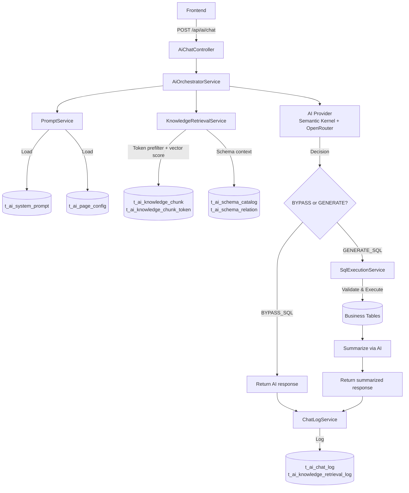
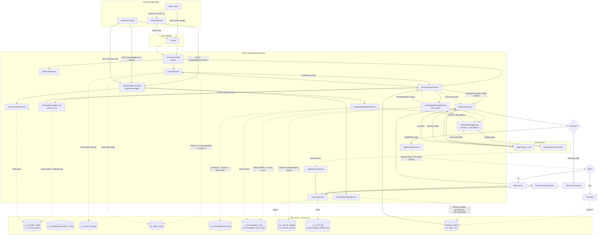

# BS-AI-Assistant: Implementation Walkthrough

## Summary

.NET 9 Web API สำหรับ AI Database Assistant ใช้ **Microsoft Semantic Kernel** + **OpenRouter** (OpenAI-compatible) ปัจจุบันระบบมี RAG pipeline เต็มรูปแบบ — vector/keyword hybrid retrieval จาก knowledge chunks และ schema catalog — ก่อนส่ง prompt ให้ LLM

## Architecture



## Detail Flowchart



## กลุ่ม Component ทั้งหมด

### 1. Frontend Application

| Component | คืออะไร |
|-----------|---------|
| **MainLayout** | Layout หลัก — โหลด active-configs แล้วแสดงปุ่ม AI ถ้า URL ตรง |
| **AiChatPopover** | กล่อง Chat pop-up — รับ input และแสดงผลตอบกลับ รองรับ quick suggestions |
| **AIAdminConsole** | Admin UI — จัดการ knowledge documents, sync schema, ดู overview stats |

### 2. API Gateway

| Component | คืออะไร |
|-----------|---------|
| **Ocelot** | Reverse Proxy — route request จาก Frontend ไปยัง microservice (:8080) |

### 3. BS-AI-Assistant Microservice

#### Controllers

| Controller | Route | หน้าที่ |
|-----------|-------|---------|
| **AiChatController** | `/api/ai/*` | Chat, suggestions, health, rate-limit, provider-config, overview-stats |
| **AiKnowledgeController** | `/api/ai/knowledge/*` | Knowledge documents, chunks, embeddings, schema sync, retrieval preview |

#### Services

| Service | หน้าที่ |
|---------|---------|
| **AiOrchestratorService** | ควบคุม pipeline หลัก: provider → prompt → RAG → AI → SQL/bypass → log |
| **AiProviderConfigService** | โหลด AI provider + model priority จาก DB, cache 5 นาที, รองรับ model fallback |
| **PromptService** | โหลด system prompt + page config จาก DB, build combined prompt |
| **KnowledgeRetrievalService** | RAG hybrid retrieval: tokenize → prefilter via token index → cosine vector score → schema context |
| **KnowledgeIngestionService** | Ingest knowledge document → chunking → embedding → token index |
| **TextEmbeddingService** | สร้าง embedding จาก external provider (ตาม `t_ai_embedding_provider_config`), fallback เป็น local TF-IDF |
| **LocalTextEmbedding** | Local TF-IDF embedding fallback (ไม่ต้องการ external API) |
| **SchemaMetadataService** | Sync SQL Server metadata (`sys.tables`, `sys.columns`, `MS_Description`) → upsert schema catalog |
| **SqlExecutionService** | รับ SQL จาก AI → keyword block → TOP inject → timeout → execute via Dapper → คืน JSON |
| **RateLimitService** | ตรวจสอบ rate limit + credit balance จาก OpenRouter API |
| **FallbackChatService** | ส่ง friendly message กรณี LLM timeout/error |
| **ChatLogService** | Insert audit log ลง `t_ai_chat_log` ทุก interaction |
| **OverviewStatsService** | Multi-query stats: provider, embedding, document/chunk counts, recent chat activity |

### 4. External API

| Component | คืออะไร |
|-----------|---------|
| **OpenRouter / LLM** | OpenAI-compatible endpoint รองรับหลาย model — model ที่ใช้อ่านจาก DB ตาม priority order |
| **Embedding Provider API** | External embedding API (configurable ใน `t_ai_embedding_provider_config`) |

### 5. SQL Server — schema `ais`

| ตาราง | เก็บอะไร |
|-------|---------|
| `t_ai_provider_config` | AI provider (base URL, endpoint, timeout, file attachment config) |
| `t_ai_model_priority` | Model list เรียงลำดับ fallback ต่อ provider |
| `t_ai_embedding_provider_config` | Embedding provider (URL, model, dimension) |
| `t_ai_system_prompt` | System prompt หลัก: บทบาทของ AI |
| `t_ai_page_config` | Config ต่อหน้า: allowed tables/columns, sub-prompt, process code |
| `t_ai_knowledge_document` | เอกสารต้นทาง knowledge base (manual docs, schema summaries) |
| `t_ai_knowledge_chunk` | Chunks พร้อม embedding vector สำหรับ RAG retrieval |
| `t_ai_knowledge_chunk_token` | Inverted token index สำหรับ BM25 prefiltering ก่อน vector scoring |
| `t_ai_schema_catalog` | Snapshot ของ DB schema + `MS_Description` descriptions |
| `t_ai_schema_relation` | Foreign key relations ที่ sync มาจาก SQL Server metadata |
| `t_ai_chat_log` | Audit log ทุก chat: user, SQL, AI response, tokens, timing |
| `t_ai_knowledge_retrieval_log` | บันทึกว่าแต่ละ chat ใช้ knowledge chunk / schema ไหน |

---

## ขั้นตอนการทำงาน Step-by-Step

### Phase 1: Initialization (โหลดหน้าเว็บ)

```
1. MainLayout → GET /api/ai/active-configs → Ocelot → AiChatController
2. AiChatController → PromptService → อ่าน t_ai_page_config WHERE is_active=1
3. PromptService → คืนรายชื่อ process ที่เปิดใช้งาน
4. MainLayout → ถ้า URL ปัจจุบันตรงกับ config → แสดงปุ่ม AI
```

### Phase 2: Chat Request

```
5. AiChatPopover → POST /api/ai/chat { process, user_message, user_id } → Ocelot → AiChatController
6. AiChatController → RateLimitService (ตรวจว่าเกิน limit ไหม)
7. AiChatController → AiOrchestratorService.ProcessChatAsync()
```

### Phase 3: Build Prompt + RAG Context

```
8. Orchestrator → AiProviderConfigService
   - โหลด provider config + model priority จาก DB (cached 5 นาที)

9. Orchestrator → PromptService
   - อ่าน system prompt จาก t_ai_system_prompt
   - อ่าน page config จาก t_ai_page_config (allowed tables/columns)
   - build combined prompt

10. Orchestrator → KnowledgeRetrievalService
    - TextEmbeddingService embed user query (external API หรือ local fallback)
    - tokenize query → JOIN t_ai_knowledge_chunk_token → candidate chunk set
    - คำนวณ cosine similarity กับ embedding vector ของแต่ละ chunk
    - โหลด schema catalog rows ที่เกี่ยวข้องกับ allowed tables + query terms
    - โหลด schema relations ที่เชื่อมกับ tables ที่พบ
    - format เป็น "RAG context" block
    → append เข้า combined prompt
```

### Phase 4: AI Decision

```
11. Orchestrator → Semantic Kernel → OpenRouter (model ตาม priority order)
    OpenRouter ประมวลผล → คืน JSON decision

12. Orchestrator วิเคราะห์ decision มี 2 เส้นทาง:
```

**เส้นทาง A — BYPASS_SQL** (คำถามทั่วไปที่ตอบได้จาก RAG context หรือความรู้ AI):

```
→ AI ตอบตรงเลย ไม่ต้อง query DB
→ ไปขั้นตอน Log
```

**เส้นทาง B — GENERATE_SQL** (คำถามที่ต้องการข้อมูลจริงจาก DB):

```
13. SqlExecutionService รับ SQL ที่ AI สร้าง
    → block DML/DDL keywords (DELETE, DROP, UPDATE, INSERT, EXEC ฯลฯ)
    → inject TOP row limit
    → validate syntax ด้วย SET NOEXEC ON
    → ถ้าปลอดภัย: Execute ผ่าน Dapper → คืน JSON results
    → ถ้าอันตราย: คืน Safety Error กลับ

14. Orchestrator ส่ง JSON data กลับไป OpenRouter
    → AI สรุปข้อมูลเป็นภาษาที่อ่านง่าย
    → คืน summarized response
```

### Phase 5: Logging & Response

```
15. ChatLogService → Insert ลง t_ai_chat_log (ทุก path ต้องผ่านนี้)
    - บันทึก: user_id, process, user_message, ai_response, generated_sql, tokens, timing
16. RetrievalLog → Insert ลง t_ai_knowledge_retrieval_log (ถ้ามี RAG context)
17. AiChatController → คืน ChatResponse กลับ → Ocelot → AiChatPopover แสดงผล
```

---

## API Endpoints

### AiChatController — `/api/ai`

| Method | Path | หน้าที่ |
|--------|------|---------|
| `POST` | `/chat` | ส่งคำถาม → คืน AI response (BYPASS_SQL หรือ GENERATE_SQL) |
| `POST` | `/suggestions` | สร้าง quick-pick question suggestions ตาม process |
| `GET` | `/active-configs` | รายชื่อ process ที่เปิด AI |
| `GET` | `/health` | Health check |
| `GET` | `/rate-limit` | ดู credit balance + rate limit จาก OpenRouter |
| `GET` | `/provider-config` | ดู active AI provider config (จาก cache หรือ DB) |
| `POST` | `/config/refresh` | Invalidate provider config cache (reload จาก DB ครั้งถัดไป) |
| `GET` | `/overview-stats` | สถิติรวม: provider, knowledge, schema, recent chat |

### AiKnowledgeController — `/api/ai/knowledge`

| Method | Path | หน้าที่ |
|--------|------|---------|
| `POST` | `/documents` | สร้าง knowledge document (พร้อม chunk อัตโนมัติ) |
| `GET` | `/documents` | รายการ knowledge documents + chunk counts |
| `POST` | `/documents/{id}/chunks` | Build chunks สำหรับ document เดียว |
| `POST` | `/rebuild-chunks` | Rebuild chunks ทุก document ที่ active |
| `POST` | `/rebuild-embeddings` | Rebuild vector embeddings ทุก chunk ที่ active |
| `POST` | `/sync-schema` | Sync SQL Server schema metadata → upsert schema catalog |
| `GET` | `/schema-catalog` | Preview schema catalog ที่ AI มองเห็น |
| `GET` | `/retrieval-preview` | Preview RAG context ที่จะ inject สำหรับ process/query นี้ |

---

## Decision Tree สรุป

```
คำถามผู้ใช้
    │
    ├── PromptService: load system prompt + page config
    │
    ├── KnowledgeRetrievalService: RAG context
    │       ├── tokenize query → token index prefilter
    │       ├── vector similarity scoring
    │       └── schema catalog + relations
    │
    ├── LLM receives: system prompt + page context + RAG context + user question
    │
    └── Decision
            ├── BYPASS_SQL → ตอบตรง (เร็ว, ไม่ query DB)
            └── GENERATE_SQL
                    ├── AI สร้าง SQL
                    ├── ตรวจความปลอดภัย
                    ├── Query จาก DB
                    └── AI สรุปผลเป็นภาษาคน
```

---

## Files Structure

### SQL Scripts

| File | Purpose |
|------|---------|
| [create_ai_tables.sql](../AiAssistant/SQL/create_ai_tables.sql) | สร้าง `t_ai_system_prompt`, `t_ai_page_config`, `t_ai_chat_log` + seed data |
| [create_ai_provider_config.sql](../AiAssistant/SQL/create_ai_provider_config.sql) | สร้าง `t_ai_provider_config`, `t_ai_model_priority` |
| [create_ai_knowledge_base.sql](../AiAssistant/SQL/create_ai_knowledge_base.sql) | สร้าง knowledge base tables ทั้งหมด + views + indexes |
| [extend_ai_embedding_provider_vector_index.sql](../AiAssistant/SQL/extend_ai_embedding_provider_vector_index.sql) | สร้าง `t_ai_embedding_provider_config`, `t_ai_knowledge_chunk_token` |
| [migrate_ai_knowledge_base_standard_audit_columns.sql](../AiAssistant/SQL/migrate_ai_knowledge_base_standard_audit_columns.sql) | Migrate audit columns ให้เป็น standard format |
| [migrate_rename_audit_columns.sql](../AiAssistant/SQL/migrate_rename_audit_columns.sql) | Rename audit columns เดิม |
| [seed_*.sql](../AiAssistant/SQL/) | Seed data: system prompts, page configs สำหรับแต่ละ process |

### Models

| File | Purpose |
|------|---------|
| [Entities/SystemPrompt.cs](../AiAssistant/Models/Entities/SystemPrompt.cs) | Entity: `t_ai_system_prompt` |
| [Entities/AiPageConfig.cs](../AiAssistant/Models/Entities/AiPageConfig.cs) | Entity: `t_ai_page_config` |
| [Entities/ChatLog.cs](../AiAssistant/Models/Entities/ChatLog.cs) | Entity: `t_ai_chat_log` |
| [Entities/AiProviderConfig.cs](../AiAssistant/Models/Entities/AiProviderConfig.cs) | Entity: `t_ai_provider_config` + `t_ai_model_priority` |
| [Requests/ChatRequest.cs](../AiAssistant/Models/Requests/ChatRequest.cs) | Request: `process`, `user_message`, `user_id` |
| [Requests/KnowledgeIngestionRequests.cs](../AiAssistant/Models/Requests/KnowledgeIngestionRequests.cs) | Requests: create document, build chunks, build embeddings |
| [Responses/ChatResponse.cs](../AiAssistant/Models/Responses/ChatResponse.cs) | Response: `ai_response`, `ai_decision`, `generated_sql`, tokens |
| [Responses/KnowledgeIngestionResponses.cs](../AiAssistant/Models/Responses/KnowledgeIngestionResponses.cs) | Responses: document create, chunk build, embedding build |
| [Responses/KnowledgeRetrievalResult.cs](../AiAssistant/Models/Responses/KnowledgeRetrievalResult.cs) | RAG retrieval result (formatted context + chunk/schema counts) |
| [Responses/SchemaSyncResponse.cs](../AiAssistant/Models/Responses/SchemaSyncResponse.cs) | Schema sync result |
| [Responses/OverviewStatsResponse.cs](../AiAssistant/Models/Responses/OverviewStatsResponse.cs) | Admin overview stats |

### Services

| File | Purpose |
|------|---------|
| [AiOrchestratorService.cs](../AiAssistant/Services/Implementation/AiOrchestratorService.cs) | Main pipeline: provider → prompt → RAG → AI → SQL/bypass → summarize → log |
| [AiProviderConfigService.cs](../AiAssistant/Services/Implementation/AiProviderConfigService.cs) | Dynamic provider config จาก DB, IMemoryCache 5 min, model priority fallback |
| [PromptService.cs](../AiAssistant/Services/Implementation/PromptService.cs) | Load prompts, build combined context |
| [KnowledgeRetrievalService.cs](../AiAssistant/Services/Implementation/KnowledgeRetrievalService.cs) | RAG hybrid: token index prefilter + vector cosine + schema context |
| [KnowledgeIngestionService.cs](../AiAssistant/Services/Implementation/KnowledgeIngestionService.cs) | Document ingest → chunking → embedding → token index |
| [TextEmbeddingService.cs](../AiAssistant/Services/Implementation/TextEmbeddingService.cs) | External embedding API (configurable), fallback local |
| [LocalTextEmbedding.cs](../AiAssistant/Services/Implementation/LocalTextEmbedding.cs) | Local TF-IDF embedding fallback |
| [SchemaMetadataService.cs](../AiAssistant/Services/Implementation/SchemaMetadataService.cs) | Sync `sys.*` metadata + `MS_Description` → schema catalog |
| [SqlExecutionService.cs](../AiAssistant/Services/Implementation/SqlExecutionService.cs) | Safe SQL execution: keyword block, TOP inject, timeout, Dapper |
| [RateLimitService.cs](../AiAssistant/Services/Implementation/RateLimitService.cs) | Rate limit + credit balance จาก OpenRouter API |
| [FallbackChatService.cs](../AiAssistant/Services/Implementation/FallbackChatService.cs) | Fallback message กรณี LLM unavailable |
| [ChatLogService.cs](../AiAssistant/Services/Implementation/ChatLogService.cs) | Audit logging ลง `t_ai_chat_log` |
| [OverviewStatsService.cs](../AiAssistant/Services/Implementation/OverviewStatsService.cs) | Multi-query stats สำหรับ admin dashboard |

### Controllers

| File | Purpose |
|------|---------|
| [AiChatController.cs](../AiAssistant/Controllers/AiChatController.cs) | Chat, suggestions, health, rate-limit, provider-config endpoints |
| [AiKnowledgeController.cs](../AiAssistant/Controllers/AiKnowledgeController.cs) | Knowledge management + schema sync + retrieval preview endpoints |

---

## Build Status

```
✅ dotnet restore — Success
✅ dotnet build — 0 Warnings, 0 Errors
```

## Knowledge Base Setup (ทำครั้งแรก)

1. รัน SQL scripts ตามลำดับ:
   - `create_ai_tables.sql`
   - `create_ai_provider_config.sql`
   - `create_ai_knowledge_base.sql`
   - `extend_ai_embedding_provider_vector_index.sql`
   - `migrate_*` scripts
   - `seed_*` scripts
2. กำหนด AI provider ใน `t_ai_provider_config` + `t_ai_model_priority`
3. กำหนด embedding provider ใน `t_ai_embedding_provider_config` (หรือใช้ local fallback)
4. เพิ่ม knowledge documents ผ่าน `POST /api/ai/knowledge/documents`
5. Sync schema metadata ผ่าน `POST /api/ai/knowledge/sync-schema`
6. ตรวจสอบ RAG context ผ่าน `GET /api/ai/knowledge/retrieval-preview`