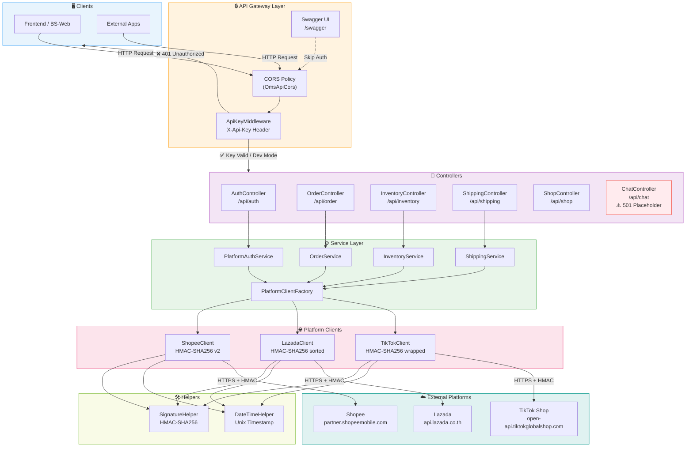
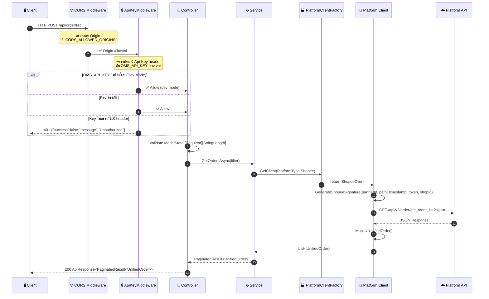
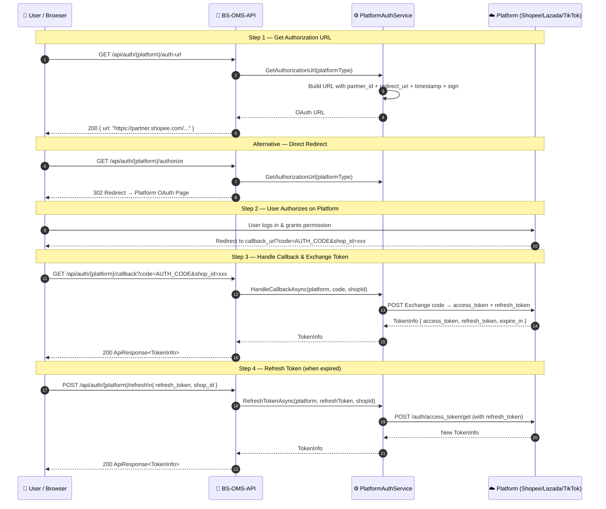
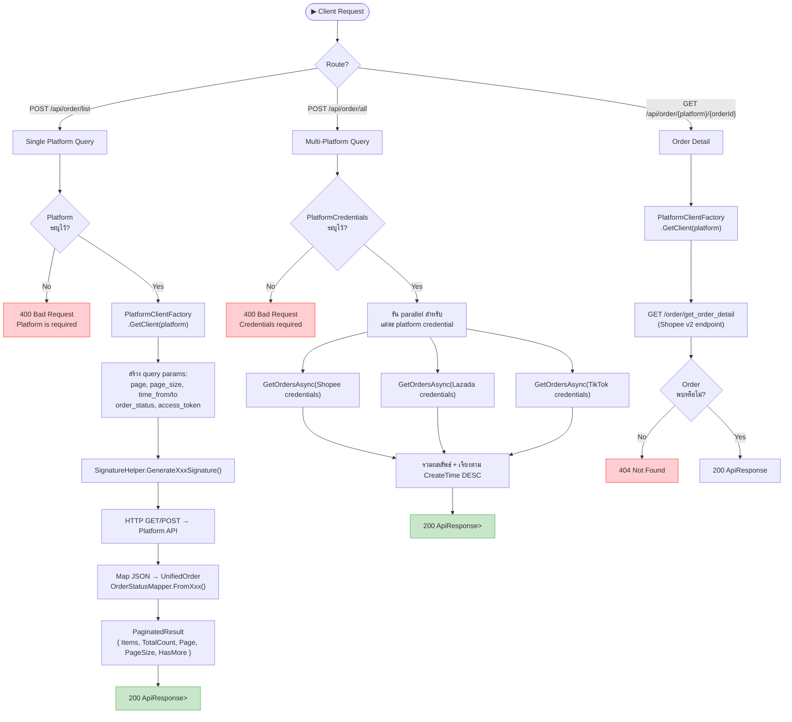
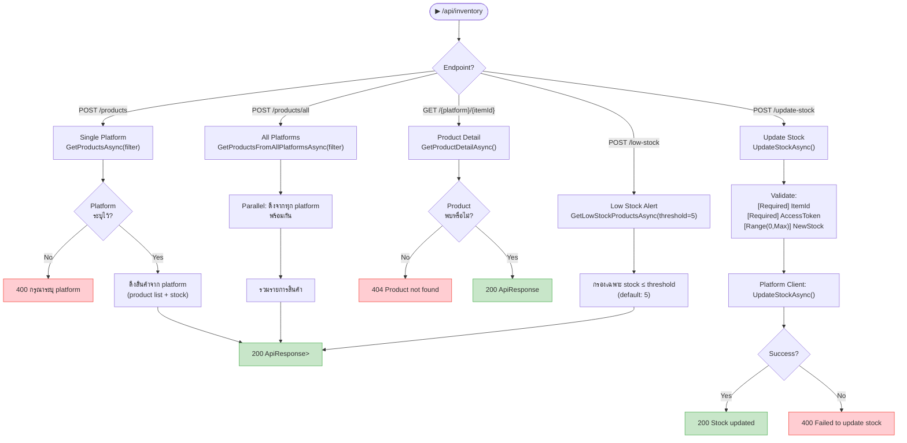
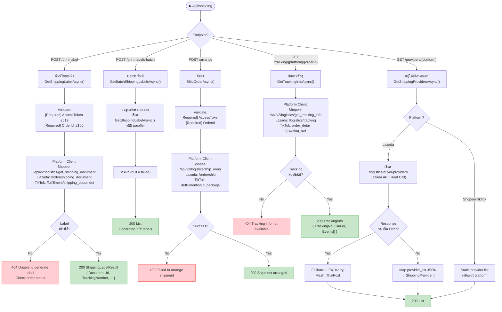
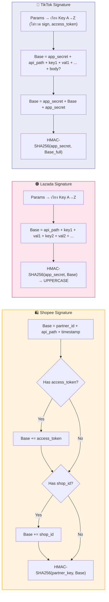
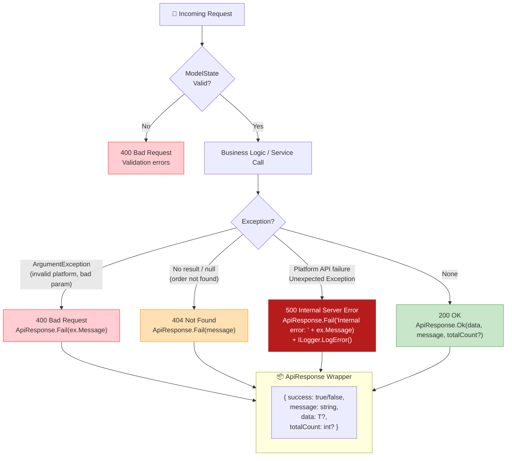
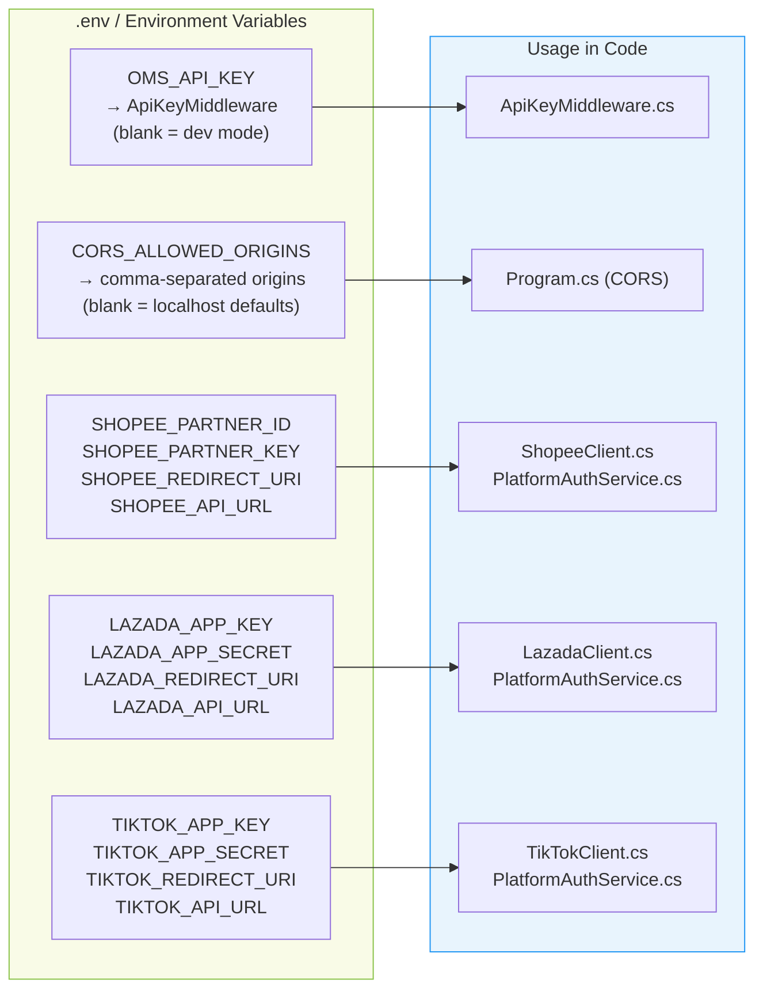

# BS-OMS-API — Process Flow Diagram

## Overview

BS-OMS-API เป็น **Stateless API Gateway** สำหรับรวมข้อมูล e-commerce จากหลายแพลตฟอร์ม  
รองรับ: **Shopee Open Platform API v2**, **Lazada Open Platform**, **TikTok Shop API v202309**

---

## 1. Overall System Architecture

---

## 2. Request Lifecycle (Happy Path)

---

## 3. OAuth Authentication Flow

---

## 4. Order Management Flow

---

## 5. Inventory Management Flow

---

## 6. Shipping Management Flow

---

## 7. Signature Generation Per Platform

---

## 8. Error Handling Strategy

---

## 9. Configuration & Environment Variables

---

## 10. API Endpoint Summary

| Method | Endpoint                                      | Description                    | Auth Required |
| ------ | --------------------------------------------- | ------------------------------ | :-----------: |
| `GET`  | `/api/auth/{platform}/authorize`              | Redirect to OAuth page         |      ❌       |
| `GET`  | `/api/auth/{platform}/auth-url`               | Get OAuth URL (no redirect)    |      ❌       |
| `GET`  | `/api/auth/{platform}/callback`               | OAuth callback handler         |      ❌       |
| `POST` | `/api/auth/{platform}/refresh`                | Refresh access token           |      ✅       |
| `POST` | `/api/order/list`                             | Get orders (single platform)   |      ✅       |
| `POST` | `/api/order/all`                              | Get orders (all platforms)     |      ✅       |
| `GET`  | `/api/order/{platform}/{orderId}`             | Get order detail               |      ✅       |
| `POST` | `/api/inventory/products`                     | Get products (single platform) |      ✅       |
| `POST` | `/api/inventory/products/all`                 | Get products (all platforms)   |      ✅       |
| `GET`  | `/api/inventory/{platform}/{itemId}`          | Get product detail             |      ✅       |
| `POST` | `/api/inventory/low-stock`                    | Get low stock alert            |      ✅       |
| `POST` | `/api/inventory/update-stock`                 | Update stock quantity          |      ✅       |
| `POST` | `/api/shipping/print-label`                   | Print shipping label           |      ✅       |
| `POST` | `/api/shipping/print-labels-batch`            | Batch print labels             |      ✅       |
| `POST` | `/api/shipping/arrange`                       | Arrange shipment               |      ✅       |
| `GET`  | `/api/shipping/tracking/{platform}/{orderId}` | Track parcel                   |      ✅       |
| `GET`  | `/api/shipping/providers/{platform}`          | Get shipping providers         |      ✅       |
| `GET`  | `/api/shop`                                   | Get connected shops            |      ✅       |
| `GET`  | `/api/chat/conversations`                     | ⚠️ 501 — Planned               |      ✅       |
| `GET`  | `/api/chat/conversations/{id}/messages`       | ⚠️ 501 — Planned               |      ✅       |
| `POST` | `/api/chat/conversations/{id}/send`           | ⚠️ 501 — Planned               |      ✅       |

---

## Change Log

### v1.1.0 — 2026-05-01

#### 🔒 Security

- **[CRITICAL] Added `ApiKeyMiddleware`** — ตรวจสอบ `X-Api-Key` header ทุก request
  - อ่าน key จาก `OMS_API_KEY` environment variable
  - หากไม่ตั้งค่า → Dev Mode (อนุญาตทุก request)
  - ข้าม `/swagger` และ `/openapi` paths โดยอัตโนมัติ
  - คืน HTTP 401 JSON เมื่อ key ไม่ถูกต้องหรือขาดหาย
  - ไฟล์: `Middleware/ApiKeyMiddleware.cs`

- **[CRITICAL] แก้ไข CORS Wildcard** — ลบ `"*"` origins
  - อ่าน origins จาก `CORS_ALLOWED_ORIGINS` env var (comma-separated)
  - ค่า default: `localhost:3000`, `localhost:5173`, `localhost:8080`
  - Policy name เปลี่ยนจาก env var เป็น const `"OmsApiCors"`
  - ไฟล์: `Program.cs`

- **[MODERATE] เพิ่ม Swagger Security Definition** — เพิ่ม `X-Api-Key` ใน Swagger UI
  - ผู้ใช้สามารถทดสอบ authenticated endpoints ได้จาก Swagger โดยตรง
  - ไฟล์: `Program.cs`

#### ✅ Validation

- **เพิ่ม Model Validation Attributes** บน 5 model files:
  - `Models/Orders/OrderFilter.cs` — `[StringLength(512)]` บน `AccessToken`; `[Required][StringLength(512)]` บน `PlatformCredentialInput.AccessToken`
  - `Models/Shipping/ShippingModels.cs` — `[Required][StringLength(512/100)]` บน `ShippingLabelRequest` และ `ShipOrderRequest`
  - `Models/Inventory/InventoryModels.cs` — `[StringLength(512)]` บน `ProductFilter.AccessToken`; `[Required]`, `[StringLength]`, `[Range(0, int.MaxValue)]` บน `UpdateStockRequest`
  - `Models/Auth/AuthModels.cs` — `[Required][StringLength(512)]` บน `RefreshTokenRequest.RefreshToken`

#### 🐛 Bug Fixes

- **แก้ไข HTTP Status Codes ใน `OrderController`** — `catch(Exception)` blocks ทั้งหมด  
  เปลี่ยนจาก `return BadRequest(...)` เป็น `return StatusCode(500, ...)` ให้ถูกต้องตาม HTTP semantics
  - `ArgumentException` ยังคืน 400 ตามเดิม (client error)
  - ไฟล์: `Controllers/OrderController.cs`

#### 🔧 Improvements

- **แก้ไข `LazadaClient.GetShippingProvidersAsync`** — เปลี่ยนจาก hardcoded list เป็น real API call
  - เรียก Lazada `/logistics/buyer/providers` endpoint จริง
  - Parse `data.provider_list[]` → map `provider_code`/`provider_name`/`is_active`
  - Fallback กลับ hardcoded list (LEX, Kerry, Flash, ThaiPost) เมื่อ API ไม่ตอบสนองหรือ response ว่าง
  - ไฟล์: `Services/Implementation/Platforms/LazadaClient.cs`

#### 🧪 Tests

- **สร้าง Unit Test Project** `OmsApi.Tests` — xUnit v2.9.2 + .NET 9.0
  - `OrderStatusMapperTests.cs` — 27 tests ครอบคลุม Shopee/Lazada/TikTok status mapping
  - `SignatureHelperTests.cs` — 14 tests ครอบคลุม HMAC-SHA256, signature generation ทุก platform
  - `DateTimeHelperTests.cs` — 9 tests ครอบคลุม Unix timestamp conversion + round-trip
  - `ApiResponseAndPaginationTests.cs` — 16 tests ครอบคลุม `ApiResponse<T>` และ `PaginatedResult<T>`
  - `ApiKeyMiddlewareTests.cs` — 11 tests ครอบคลุม dev mode, Swagger bypass, valid/invalid keys
  - **รวม 77 tests — ผ่านทั้งหมด ✅**

---

### v1.0.0 — Initial Release

- Stateless API Gateway รองรับ Shopee, Lazada, TikTok Shop
- Controller: Auth, Order, Inventory, Shipping, Shop, Chat (placeholder)
- HMAC-SHA256 signature per platform (SignatureHelper)
- Unix timestamp helper (DateTimeHelper)
- Unified order status mapping (OrderStatusMapper)
- Swagger UI at `/swagger`
- DotNetEnv `.env` file support
- Docker support (`Dockerfile`, `docker-compose.yml`)
