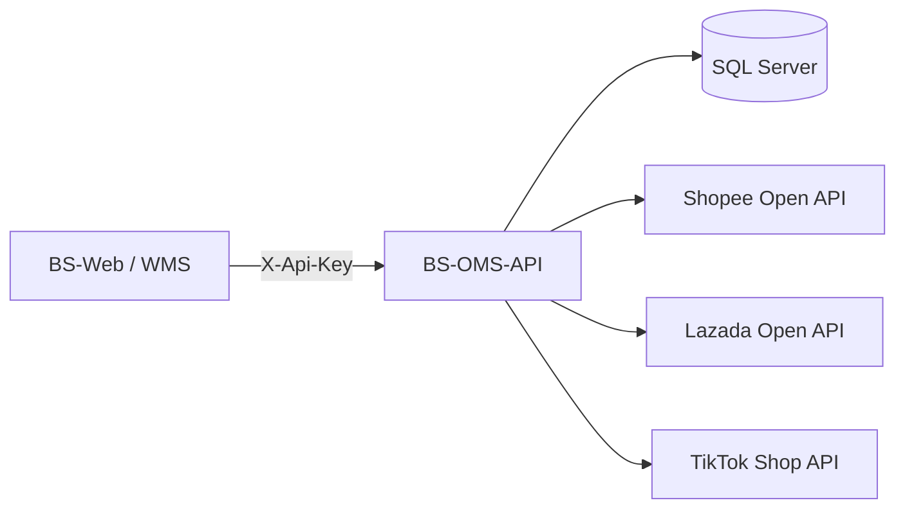
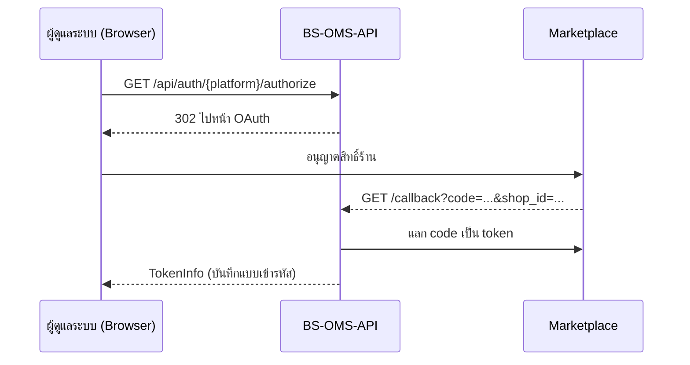
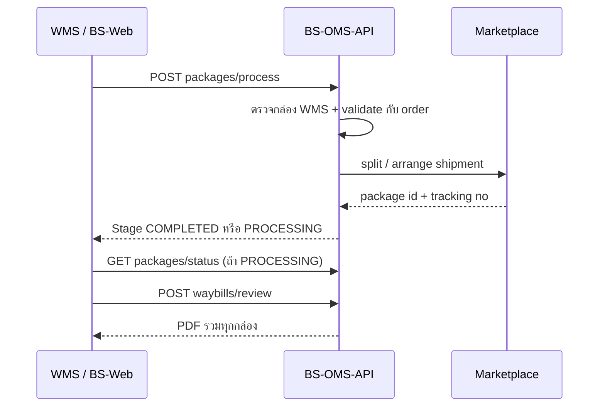

# BS-OMS-API — API Documentation

เอกสารประกอบการใช้งาน API ระบบ Order Management System สำหรับ Shopee, Lazada และ TikTok Shop

| เวอร์ชันเอกสาร | วันที่ | API Version | Source |
| --- | --- | --- | --- |
| 1.0 | 24 กันยายน 2026 | v1 (.NET 9) | OMS / BS-OMS-API (commit 1b6e732) |

## สารบัญ

1. [ภาพรวมระบบ](#1-ภาพรวมระบบ)
2. [Authentication](#2-authentication)
3. [รูปแบบ Request และ Response](#3-รูปแบบ-request-และ-response)
4. [สรุป Endpoint ทั้งหมด](#4-สรุป-endpoint-ทั้งหมด)
5. [Auth API](#5-auth-api)
6. [Order API](#6-order-api)
7. [Inventory API](#7-inventory-api)
8. [Shipping API](#8-shipping-api)
9. [Shop และ Chat API](#9-shop-และ-chat-api)
10. [Data Models](#10-data-models)
11. [การตั้งค่าและการ Deploy](#11-การตั้งค่าและการ-deploy)
12. [ข้อสังเกตจากการตรวจโค้ด](#12-ข้อสังเกตจากการตรวจโค้ด)

---

## 1. ภาพรวมระบบ

BS-OMS-API เป็น REST API กลางที่รวมคำสั่งซื้อ สต็อก และการจัดส่งของ **Shopee, Lazada และ TikTok Shop** ไว้ใน interface เดียว ระบบอื่น เช่น BS-Web และ WMS เรียก API นี้แทนการเรียก Marketplace โดยตรง

### 1.1 ข้อมูลทั่วไป

| หัวข้อ | รายละเอียด |
| --- | --- |
| Framework | ASP.NET Core Web API, .NET 9 |
| Database | SQL Server ผ่าน EF Core 9 (เปิดใช้เมื่อตั้ง `OMS_DB_CONNECTION_STRING`) |
| API Docs | Swagger UI ที่ `/swagger` (path `/` redirect ไป Swagger) |
| Local URL | `https://localhost:53954`, `http://localhost:53955` |
| Docker | container port 8080 → host port 8182 |
| IIS | รองรับ virtual path เช่น `/WM3_OMS` |
| Platform ที่รองรับ | `Shopee`, `Lazada`, `TikTok` (enum `PlatformType`) |

### 1.2 สถาปัตยกรรม



1. Client (BS-Web / WMS) ส่ง HTTP request พร้อม header `X-Api-Key`
2. CORS policy และ `ApiKeyMiddleware` ตรวจสอบ origin และ API Key
3. Controller ตรวจ parameter แล้วเรียก Service (`OrderService`, `InventoryService`, `ShippingService` ฯลฯ)
4. `PlatformClientFactory` เลือก `ShopeeClient`, `LazadaClient` หรือ `TikTokClient` ซึ่งเซ็น request ด้วย HMAC-SHA256
5. Platform client เรียก Marketplace API แล้วแปลงผลเป็นโมเดลกลาง (เช่น `UnifiedOrder`)
6. Token และข้อมูล order / package / waybill ถูกเก็บใน SQL Server

### 1.3 โครงสร้างโปรเจกต์

| โฟลเดอร์ / ไฟล์ | หน้าที่ |
| --- | --- |
| `Controllers/` | Auth, Order, Inventory, Shipping, Shop, Chat |
| `Services/` | Business logic และ platform clients (Shopee, Lazada, TikTok) |
| `Models/` | DTO แยกตาม Auth, Common, Orders, Inventory, Shipping, Persistence |
| `Middleware/ApiKeyMiddleware.cs` | ตรวจสอบ API Key |
| `Extensions/` | `ApplicationDbContext` และ `PlatformShopIdResolver` |
| `Database/`, `Migrations/` | SQL script และ EF Core migrations |
| `OmsApi.Tests/` | Unit tests (xUnit) |

---

## 2. Authentication

### 2.1 API Key

ทุก request ต้องส่ง header `X-Api-Key` ที่ตรงกับค่า `OMS_API_KEY` ของเซิร์ฟเวอร์ การเทียบเป็นแบบ case-sensitive

```http
GET /api/order/shopee/240924ABCDEF?accessToken=... HTTP/1.1
Host: localhost:53954
X-Api-Key: <your-api-key>
Content-Type: application/json
```

> **Dev mode:** ถ้าไม่ได้ตั้ง `OMS_API_KEY` ระบบจะอนุญาตทุก request โดยไม่ตรวจ API Key ต้องตั้งค่านี้ทุกครั้งบน environment จริง

API Key ไม่ถูกหรือไม่มี จะได้ `401 Unauthorized`:

```json
{
  "success": false,
  "message": "Unauthorized: Invalid or missing API key. Include 'X-Api-Key' header."
}
```

### 2.2 Path ที่ไม่ต้องใช้ API Key

- `/swagger/*`, `/scalar/*`, `/openapi/*`
- `/api/auth/{platform}/authorize`, `/api/auth/{platform}/auth-url`, `/api/auth/{platform}/callback` (เปิดจาก browser ระหว่างทำ OAuth)

### 2.3 การเชื่อมร้านค้า (OAuth กับ Marketplace)

OMS-API เก็บ access/refresh token ของแต่ละร้านแบบเข้ารหัส (ASP.NET Data Protection) ไว้ในตาราง `oms.t_oms_platform_credential`



1. ผู้ดูแลระบบเปิด `GET /api/auth/{platform}/authorize` ใน browser
2. OMS-API redirect (302) ไปหน้าอนุญาตสิทธิ์ของ Marketplace
3. ผู้ดูแลล็อกอินและอนุญาตสิทธิ์ร้าน
4. Marketplace redirect กลับมาที่ `/api/auth/{platform}/callback?code=...&shop_id=...`
5. OMS-API แลก code เป็น token แล้วบันทึกแบบเข้ารหัส และคืน `TokenInfo`

### 2.4 การใช้ token ของ Marketplace

| กลุ่ม Endpoint | วิธีใช้ token |
| --- | --- |
| Shipping (package, waybill, tracking, test-connection) | ใช้ token ที่ OMS เก็บไว้ ส่งแค่ `shopId` |
| Order, Inventory, print-label, arrange, providers | ต้องส่ง `accessToken` ของ Marketplace มาใน request |

ค่า `{platform}` ใน path ใช้ `shopee`, `lazada`, `tiktok` (ไม่สนตัวพิมพ์เล็ก-ใหญ่)

---

## 3. รูปแบบ Request และ Response

### 3.1 Response มาตรฐาน

ทุก endpoint ตอบกลับเป็น JSON ห่อด้วย `ApiResponse<T>` (ชื่อ field เป็น camelCase) ยกเว้น endpoint ที่คืนไฟล์ PDF และ OAuth redirect

```json
{
  "success": true,
  "message": "Retrieved 50 orders from Shopee",
  "data": { },
  "totalCount": 120
}
```

| Field | Type | ความหมาย |
| --- | --- | --- |
| `success` | bool | `true` = สำเร็จ |
| `message` | string | ข้อความผลลัพธ์หรือ error |
| `data` | T \| null | ข้อมูลผลลัพธ์ (เป็น `null` เมื่อ error) |
| `totalCount` | int \| null | จำนวนทั้งหมด (เฉพาะ endpoint แบบ list) |

### 3.2 Pagination

Endpoint แบบแบ่งหน้ารับ `page` (เริ่มที่ 1) และ `pageSize` (default 50) แล้วคืน `data` เป็น `PaginatedResult<T>`:

```json
{ "items": [ ], "totalCount": 120, "page": 1, "pageSize": 50, "hasMore": true }
```

### 3.3 ค่า Enum

โปรเจกต์ไม่ได้ตั้ง `JsonStringEnumConverter` ดังนั้น enum ใน JSON body และ response เป็น**ตัวเลข** ส่วนใน path/query ใช้ชื่อได้

| PlatformType | ค่าใน JSON |
| --- | --- |
| Shopee | `0` |
| Lazada | `1` |
| TikTok | `2` |

### 3.4 HTTP Status Codes

| Code | เมื่อไหร่ |
| --- | --- |
| 200 | สำเร็จ |
| 302 | OAuth redirect (`/authorize`) |
| 400 | Parameter ไม่ครบหรือไม่ถูกต้อง, platform ไม่รองรับ, Marketplace ปฏิเสธ |
| 401 | API Key ไม่ถูกหรือไม่มี |
| 404 | ไม่พบ order / product / package / waybill |
| 500 | Error ภายใน (`message` = `Internal error: ...`) |
| 501 | Endpoint ที่ยังไม่ implement (Chat) |
| 503 | Document service ไม่พร้อม (ไม่ได้ตั้งฐานข้อมูล) |

### 3.5 Error จาก Marketplace

เมื่อ Marketplace ปฏิเสธ (`PlatformApiException`) API จะคืน 400 และ `message` มีรูปแบบ:

```text
{Platform} API error '{code}': {message} (request_id: {requestId})
```

---

## 4. สรุป Endpoint ทั้งหมด

API มี 35 endpoint ใน 6 controller ทุก path ขึ้นต้นด้วย `/api` ส่วน Shop และ Chat ยังเป็น placeholder

| กลุ่ม | Method | Path | หน้าที่ |
| --- | --- | --- | --- |
| Auth | GET | `/api/auth/{platform}/authorize` | Redirect ไปหน้า OAuth |
| Auth | GET | `/api/auth/{platform}/auth-url` | คืน URL OAuth |
| Auth | GET | `/api/auth/{platform}/callback` | รับ code และบันทึก token |
| Auth | POST | `/api/auth/{platform}/refresh` | Refresh access token |
| Auth | POST | `/api/auth/sandbox-token` | Import token Sandbox (Dev/ST) |
| Order | POST | `/api/order/list` | Order จาก 1 platform |
| Order | POST | `/api/order/all` | Order จากหลาย platform |
| Order | GET | `/api/order/{platform}/{orderId}` | รายละเอียด Order |
| Order | GET | `/api/order/{platform}/{orderId}/status` | สถานะ Order และ deadline |
| Order | POST | `/api/order/cancellation-deadlines` | Order ใกล้หมดเขตส่ง |
| Inventory | POST | `/api/inventory/products` | สินค้าจาก 1 platform |
| Inventory | POST | `/api/inventory/products/all` | สินค้าจากหลาย platform |
| Inventory | GET | `/api/inventory/{platform}/{itemId}` | รายละเอียดสินค้าและสต็อก |
| Inventory | POST | `/api/inventory/low-stock` | สินค้าสต็อกต่ำ |
| Inventory | POST | `/api/inventory/update-stock` | อัปเดตสต็อก |
| Shipping | GET | `/api/shipping/wms-packages/{customerOrderNumber}` | อ่านกล่องจาก WMS |
| Shipping | POST | `/api/shipping/packages/process` | ประมวลผลกล่อง WMS จนได้ Tracking |
| Shipping | GET | `/api/shipping/packages/status/{platform}/{orderId}` | สถานะ PROCESSING / COMPLETED |
| Shipping | GET | `/api/shipping/packages/{platform}/{orderId}` | Package ที่บันทึกไว้ |
| Shipping | POST | `/api/shipping/packages/sync` | บันทึก Package/Tracking เข้า OMS/WMS |
| Shipping | POST | `/api/shipping/packages/sync-from-platform` | ดึง Tracking จาก platform แล้วบันทึก |
| Shipping | POST | `/api/shipping/waybills/ensure` | สร้าง/ตรวจ Waybill |
| Shipping | GET | `/api/shipping/waybills/{platform}/{orderId}` | สถานะ Waybill |
| Shipping | GET | `/api/shipping/waybills/{platform}/{orderId}/file` | ดาวน์โหลด PDF Waybill |
| Shipping | POST | `/api/shipping/waybills/review` | รวม Waybill เป็น PDF เดียว |
| Shipping | POST | `/api/shipping/print-label` | ใบปะหน้า 1 Order |
| Shipping | POST | `/api/shipping/print-labels-batch` | ใบปะหน้าหลาย Order |
| Shipping | POST | `/api/shipping/arrange` | Arrange shipment |
| Shipping | GET | `/api/shipping/tracking/{platform}/{orderId}` | ติดตามพัสดุ |
| Shipping | GET | `/api/shipping/providers/{platform}` | รายการผู้ให้บริการขนส่ง |
| Shipping | GET | `/api/shipping/test-connection/{platform}` | ทดสอบ credential |
| Shop | GET | `/api/shop` | ร้านที่เชื่อม (placeholder) |
| Chat | GET | `/api/chat/conversations` | 501 Not implemented |
| Chat | GET | `/api/chat/conversations/{id}/messages` | 501 Not implemented |
| Chat | POST | `/api/chat/conversations/{id}/send` | 501 Not implemented |

---

## 5. Auth API

### 5.1 Redirect ไปหน้า OAuth

**`GET /api/auth/{platform}/authorize`**

Redirect (302) ไปหน้าอนุญาตสิทธิ์ของ Marketplace ใช้เปิดจาก browser ไม่ต้องใช้ API Key

| Parameter | In | Type | จำเป็น | คำอธิบาย |
| --- | --- | --- | --- | --- |
| platform | path | string | ใช่ | `shopee`, `lazada`, `tiktok` |

### 5.2 ขอ URL OAuth

**`GET /api/auth/{platform}/auth-url`**

คืน URL สำหรับหน้า OAuth โดยไม่ redirect

```json
{ "success": true, "message": "Success", "data": { "url": "https://partner.shopeemobile.com/..." } }
```

### 5.3 OAuth Callback

**`GET /api/auth/{platform}/callback`**

Marketplace เรียกกลับมาหลังผู้ใช้อนุญาตสิทธิ์ OMS แลก code เป็น token แล้วบันทึกแบบเข้ารหัส

| Parameter | In | Type | จำเป็น | คำอธิบาย |
| --- | --- | --- | --- | --- |
| platform | path | string | ใช่ | `shopee`, `lazada`, `tiktok` |
| code | query | string | ใช่ | Authorization code |
| shop_id | query | string | ไม่ | Shop ID (Shopee) |

Response `data` = `TokenInfo`: `platform`, `accessToken`, `refreshToken`, `expiresAt`, `refreshExpiresAt`, `shopId`, `shopName`

### 5.4 Refresh Token

**`POST /api/auth/{platform}/refresh`**

ขอ access token ใหม่ด้วย refresh token คืน `TokenInfo`

```json
{
  "refreshToken": "<refresh-token>",
  "shopId": "123456"
}
```

### 5.5 Import Sandbox Token

**`POST /api/auth/sandbox-token`**

บันทึก token จากเครื่องมือ Sandbox ของ Marketplace แบบเข้ารหัส

> **เงื่อนไขการใช้งาน:** ใช้ได้เมื่อ environment เป็น Development หรือ Staging หรือตั้ง `OMS_ENABLE_SANDBOX_TOKEN_IMPORT=YES` มิฉะนั้นคืน 404

```json
{
  "platform": "shopee",
  "accessToken": "<token>",
  "refreshToken": "<token>",
  "shopId": "123456",
  "shopName": "Test Shop",
  "expiresInSeconds": 14400,
  "refreshExpiresInSeconds": 2592000
}
```

| Field | Type | จำเป็น | เงื่อนไข |
| --- | --- | --- | --- |
| `platform` | string | ใช่ | ไม่เกิน 32 ตัวอักษร |
| `accessToken` | string | ใช่ | ไม่เกิน 2,048 ตัวอักษร |
| `refreshToken` | string | ไม่ | ไม่เกิน 2,048 ตัวอักษร |
| `shopId` | string | ใช่ | ไม่เกิน 128 ตัวอักษร |
| `expiresInSeconds` | int | ไม่ | 60 – 2,592,000 |
| `refreshExpiresInSeconds` | int | ไม่ | 60 – 7,776,000 |

---

## 6. Order API

### 6.1 ดึง Order จาก 1 Platform

**`POST /api/order/list`**

ดึง Order แบบแบ่งหน้าจาก platform ที่ระบุ คืน `PaginatedResult<UnifiedOrder>`

| Field (OrderFilter) | Type | จำเป็น | คำอธิบาย |
| --- | --- | --- | --- |
| `platform` | int | ใช่ | `PlatformType` |
| `accessToken` | string | ใช่ | Token ของ Marketplace (ไม่เกิน 512 ตัวอักษร) |
| `shopId` | string | Shopee | Shop ID |
| `status` | int | ไม่ | `OrderStatus` (ดูหัวข้อ 10.2) |
| `dateFrom`, `dateTo` | datetime | ไม่ | ช่วงวันที่สร้าง Order |
| `page`, `pageSize` | int | ไม่ | default 1 และ 50 |

```json
{
  "platform": 0,
  "accessToken": "<marketplace-token>",
  "shopId": "123456",
  "status": 2,
  "dateFrom": "2026-09-01T00:00:00Z",
  "dateTo": "2026-09-24T00:00:00Z",
  "page": 1,
  "pageSize": 50
}
```

### 6.2 ดึง Order จากหลาย Platform

**`POST /api/order/all`**

ดึง Order จากทุก platform ที่ส่ง credential มาพร้อมกัน (ทำงานแบบ parallel) คืน `List<UnifiedOrder>` ไม่มี `platformCredentials` จะได้ 400

```json
{
  "status": 2,
  "platformCredentials": [
    { "platform": 0, "accessToken": "<token>", "shopId": "123456" },
    { "platform": 1, "accessToken": "<token>" }
  ]
}
```

### 6.3 รายละเอียด Order

**`GET /api/order/{platform}/{orderId}`**

ดูรายละเอียด Order รวม items, shipping, tax invoice และ buyer remarks คืน `UnifiedOrder` ไม่พบคืน 404

| Parameter | In | Type | จำเป็น | คำอธิบาย |
| --- | --- | --- | --- | --- |
| platform | path | string | ใช่ | `shopee`, `lazada`, `tiktok` |
| orderId | path | string | ใช่ | เลข Order ของ Marketplace |
| accessToken | query | string | ใช่ | Token ของ Marketplace |
| shopId | query | string | ไม่ | Shop ID |

### 6.4 สถานะ Order

**`GET /api/order/{platform}/{orderId}/status`**

เช็คสถานะ Order และเส้นตายการจัดส่ง parameter เหมือน 6.3

```json
{
  "orderId": "240924ABCDEF",
  "platform": 0,
  "status": 2,
  "statusName": "ReadyToShip",
  "originalStatus": "READY_TO_SHIP",
  "cancellationDeadline": "2026-09-26T10:00:00Z",
  "daysUntilCancellation": 1,
  "isUrgent": true
}
```

`isUrgent` เป็น `true` เมื่อเหลือเวลาไม่เกิน 1 วัน

### 6.5 Order ใกล้หมดเขตส่ง

**`POST /api/order/cancellation-deadlines?daysThreshold=2`**

body = `OrderFilter` คืน Order ที่เหลือเวลาส่งไม่เกิน `daysThreshold` วัน (default 2)

---

## 7. Inventory API

### 7.1 รายการสินค้าจาก 1 Platform

**`POST /api/inventory/products`**

ดึงรายการสินค้าพร้อมสต็อก คืน `PaginatedResult<ProductItem>` ต้องระบุ `platform`

| Field (ProductFilter) | Type | จำเป็น | คำอธิบาย |
| --- | --- | --- | --- |
| `platform` | int | ใช่ | `PlatformType` |
| `accessToken` | string | ใช่ | Token ของ Marketplace |
| `shopId` | string | Shopee | Shop ID |
| `keyword` | string | ไม่ | คำค้นชื่อสินค้า |
| `itemStatus` | string | ไม่ | สถานะสินค้าของ platform |
| `page`, `pageSize` | int | ไม่ | default 1 และ 50 |

```json
{ "platform": 1, "accessToken": "<token>", "keyword": "shirt", "itemStatus": "NORMAL", "page": 1, "pageSize": 50 }
```

### 7.2 สินค้าจากหลาย Platform

**`POST /api/inventory/products/all`**

body = `ProductFilter` พร้อม `platformCredentials` คืน `List<ProductItem>`

### 7.3 รายละเอียดสินค้า

**`GET /api/inventory/{platform}/{itemId}`**

ดูรายละเอียดสินค้าและสต็อก ไม่พบคืน 404

| Parameter | In | Type | จำเป็น | คำอธิบาย |
| --- | --- | --- | --- | --- |
| platform | path | string | ใช่ | `Shopee`, `Lazada`, `TikTok` หรือ 0–2 |
| itemId | path | string | ใช่ | รหัสสินค้า |
| accessToken | query | string | ใช่ | Token ของ Marketplace |
| shopId | query | string | ไม่ | Shop ID |

### 7.4 สินค้าสต็อกต่ำ

**`POST /api/inventory/low-stock?threshold=5`**

body = `ProductFilter` คืนสินค้าที่สต็อกไม่เกิน `threshold` (default 5)

### 7.5 อัปเดตสต็อก

**`POST /api/inventory/update-stock`**

ตั้งจำนวนสต็อกใหม่ของสินค้าหรือ variation สำเร็จคืน 200 ล้มเหลวคืน 400

```json
{
  "platform": 0,
  "accessToken": "<token>",
  "shopId": "123456",
  "itemId": "100200300",
  "variationId": "555",
  "newStock": 20
}
```

---

## 8. Shipping API

กลุ่ม Package และ Waybill ใช้ token ที่ OMS เก็บไว้ จึงส่งแค่ `platform`, `shopId` และ `platformOrderId`

### 8.1 ลำดับการทำงานกับ WMS



1. WMS เรียก `POST /api/shipping/packages/process`
2. OMS ตรวจกล่อง WMS และ validate กับ Order ของ Marketplace
3. OMS split order (ถ้ามีหลายกล่อง) และ arrange shipment กับ Marketplace
4. Marketplace คืน package id และ tracking number แล้ว OMS บันทึกกลับ OMS/WMS
5. OMS ตอบ `stage` = `COMPLETED` หรือ `PROCESSING`
6. ถ้าได้ `PROCESSING` ให้เรียก `packages/process` ซ้ำ หรืออ่าน `packages/status` จนได้ `COMPLETED`
7. WMS เรียก `POST /api/shipping/waybills/review` เพื่อรับ PDF Waybill รวมทุกกล่อง

### 8.2 อ่านกล่องจาก WMS

**`GET /api/shipping/wms-packages/{customerOrderNumber}`**

อ่านกล่องและสินค้าในกล่องจาก WMS คืน `WmsPackageManifest` ไม่พบหรือพบซ้ำหลาย order คืน 404

| Parameter | In | Type | จำเป็น | คำอธิบาย |
| --- | --- | --- | --- | --- |
| customerOrderNumber | path | string | ใช่ | เลข Customer Order ใน WMS |
| platform | query | enum | ไม่ | กรองตาม platform |

`data` มี `customerOrderNumber`, `outboundOrderNumber`, `outboundOrderMasterId` และ `packages[]` (`wmsPackageRef`, `boxNumber`, `isCloseBox`, `trackingNumber`, `totalWeight`, `boxSize`, `items[]`)

### 8.3 ประมวลผลกล่อง WMS

**`POST /api/shipping/packages/process`**

ประมวลผลแบบ end-to-end ตั้งแต่ตรวจกล่อง จนบันทึก Tracking กลับ OMS/WMS

```json
{
  "platform": 0,
  "shopId": "123456",
  "platformOrderId": "240924ABCDEF",
  "customerOrderNumber": "SO-2609-0001"
}
```

> **เงื่อนไขที่คืน 400**
> - ไม่มีกล่อง หรือ `wmsPackageRef` ว่าง/ซ้ำ
> - `boxNumber` ไม่เกิน 0 หรือซ้ำ
> - มีกล่องที่ `isCloseBox` ไม่ใช่ `YES`
> - กล่องว่าง หรือมีสินค้าจำนวนไม่เกิน 0
> - Marketplace ปฏิเสธคำขอ

Response `data` (`ProcessPlatformPackagesResult`):

```json
{
  "platform": 0,
  "shopId": "123456",
  "platformOrderId": "240924ABCDEF",
  "customerOrderNumber": "SO-2609-0001",
  "stage": "COMPLETED",
  "totalBoxes": 2,
  "packages": [
    {
      "platformPackageRecordId": 101,
      "wmsPackageRef": "3f1c...",
      "boxNumber": 1,
      "itemCount": 2,
      "totalQuantity": 5,
      "platformPackageId": "OFG123",
      "trackingNumber": "TH0123456789",
      "waybillRequired": true,
      "status": "READY",
      "error": null
    }
  ]
}
```

### 8.4 สถานะการประมวลผล

**`GET /api/shipping/packages/status/{platform}/{orderId}?shopId=`**

อ่านสถานะจาก OMS โดยไม่เรียก Marketplace ไม่เคย process คืน 404 `stage` เป็น `COMPLETED` เมื่อทุกกล่องมี package id, tracking number ไม่ซ้ำกัน และ Waybill เป็น `READY` (เฉพาะกล่องที่ต้องมี Waybill)

### 8.5 Package ที่บันทึกไว้

**`GET /api/shipping/packages/{platform}/{orderId}?shopId=`**

`shopId` จำเป็น คืน `List<PlatformPackageRecordResult>` แต่ละรายการมี `boxNumber`, `platformPackageId`, `trackingNumber`, `shippingProviderId`, `shippingProviderName`, `packageStatus`, `syncStatus`, `error`

### 8.6 บันทึกผล Package

**`POST /api/shipping/packages/sync`**

ให้ WMS หรือ integration job บันทึกผล package กลับเข้ากล่อง WMS เอง คืน `SyncPlatformPackagesResult` (`totalPackages`, `succeededPackages`, `failedPackages`, `packages[]`)

```json
{
  "platform": 2,
  "shopId": "7000001",
  "platformOrderId": "5770000000001",
  "customerOrderNumber": "SO-2609-0002",
  "persistTrackingToWms": true,
  "packages": [
    {
      "wmsPackageRef": "3f1c...",
      "boxNumber": 1,
      "platformPackageId": "1150000001",
      "trackingNumber": "TT0001",
      "shippingProviderName": "J&T",
      "packageStatus": "READY",
      "items": [ { "platformSkuId": "1729", "itemNumber": "SKU-001", "quantity": 2 } ]
    }
  ]
}
```

### 8.7 ดึง Tracking จาก Platform

**`POST /api/shipping/packages/sync-from-platform`**

ดึง Tracking จาก Marketplace แล้วบันทึกลงกล่อง WMS

| Field | จำเป็น | คำอธิบาย |
| --- | --- | --- |
| `platform` | ใช่ | `PlatformType` |
| `shopId` | ไม่ | Shop ID |
| `platformOrderId` | ใช่ | เลข Order ของ Marketplace |
| `customerOrderNumber` | ใช่ | เลข Customer Order ใน WMS |
| `packageMappings[]` | split order | `wmsPackageRef` + `platformPackageId` ครบทุก package |
| `persistTrackingToWms` | ไม่ | default `true` |

### 8.8 สร้างหรือตรวจ Waybill

**`POST /api/shipping/waybills/ensure`**

สร้างหรือตรวจ Waybill ของ package ที่บันทึกไว้ คืน `List<PlatformDocumentResult>` (`platformPackageId`, `trackingNumber`, `documentType`, `documentStatus` เช่น `READY`, `fileName`, `fileSize`, `error`)

```json
{
  "platform": 1,
  "shopId": "100001",
  "platformOrderId": "880000001",
  "shippingDocumentType": "NORMAL_AIR_WAYBILL"
}
```

> **Lazada ส่งเอง:** Package ของ Lazada ที่ใช้ seller own fleet หรือ seller own tracking ไม่ต้องมี Waybill ระบบจะคืน list ว่าง

### 8.9 สถานะ Waybill

**`GET /api/shipping/waybills/{platform}/{orderId}?shopId=`**

อ่านสถานะ Waybill ที่ OMS บันทึกไว้

### 8.10 ดาวน์โหลด Waybill

**`GET /api/shipping/waybills/{platform}/{orderId}/file`**

คืนไฟล์ PDF โดยตรง (ไม่ห่อด้วย `ApiResponse`) ยังไม่พร้อมคืน 404

| Parameter | In | Type | จำเป็น | คำอธิบาย |
| --- | --- | --- | --- | --- |
| shopId | query | string | ใช่ | Shop ID |
| packageId | query | string | ไม่ | Package ของ Marketplace |
| markPrinted | query | bool | ไม่ | `true` = นับว่าพิมพ์แล้ว (default `false`) |

### 8.11 รวม Waybill เป็น PDF เดียว

**`POST /api/shipping/waybills/review`**

รวม Waybill ของกล่องที่เลือกเป็นไฟล์ `{orderId}-waybills.pdf` และบันทึกว่าพิมพ์แล้ว คืน 400 เมื่อมีกล่องที่ไม่ใช่ของ Order นี้ หรือ Waybill ยังไม่ `READY` ครบ

```json
{
  "platform": 0,
  "shopId": "123456",
  "platformOrderId": "240924ABCDEF",
  "wmsPackageRefs": [ "3f1c...", "8a2d..." ]
}
```

### 8.12 ใบปะหน้าพัสดุ

**`POST /api/shipping/print-label`**

ขอใบปะหน้า (Shipping Label / AWB) ของ 1 Order สร้างไม่ได้คืน 404

| Field | จำเป็น | คำอธิบาย |
| --- | --- | --- |
| `platform` | ใช่ | `PlatformType` |
| `accessToken` | ใช่ | Token ของ Marketplace |
| `shopId` | ไม่ | Shop ID |
| `orderId` | ใช่ | เลข Order |
| `packageId` | ไม่ | Package ID (TikTok) |
| `trackingNumber` | ไม่ | เลข Tracking |
| `documentType` | ไม่ | default `NORMAL_AIR_WAYBILL` |

Response `ShippingLabelResult` มี `trackingNumber`, `documentUrl` หรือ `documentBase64`, `contentType`, `status`, `carrier`

**`POST /api/shipping/print-labels-batch`** — ขอใบปะหน้าหลาย Order พร้อมกัน body เป็น array ของ `ShippingLabelRequest`

### 8.13 Arrange Shipment

**`POST /api/shipping/arrange`**

Arrange shipment ทีละ Order `shippingMethod` รับ `pickup`, `dropoff` (default) หรือ `non_integrated`

```json
{
  "platform": 0,
  "accessToken": "<token>",
  "shopId": "123456",
  "orderId": "240924ABCDEF",
  "packageId": null,
  "shippingMethod": "dropoff",
  "trackingNumber": null,
  "shippingProviderId": null
}
```

### 8.14 ติดตามพัสดุ

**`GET /api/shipping/tracking/{platform}/{orderId}?shopId=`**

คืน `TrackingInfo` (`trackingNumber`, `carrier`, `status`, `events[]`, `packages[]`) ใช้ credential ที่ OMS เก็บไว้เท่านั้น ไม่รับ token ใน URL

### 8.15 ผู้ให้บริการขนส่ง

**`GET /api/shipping/providers/{platform}?accessToken=&shopId=`**

คืน `List<ShippingProvider>` (`providerId`, `name`, `platform`, `enabled`)

### 8.16 ทดสอบการเชื่อมต่อ

**`GET /api/shipping/test-connection/{platform}?shopId=`**

ทดสอบ credential ที่เก็บไว้โดยไม่เปิดเผย token คืน 200 เสมอ ให้ดูผลที่ `data.connected` — `data` มี `connected`, `credentialFound`, `shopId`, `shippingProviderCount`, `message`, `errorCode`, `requestId`, `checkedAtUtc`

---

## 9. Shop และ Chat API

ทั้งสองกลุ่มยังเป็น placeholder และยังไม่ได้เชื่อมกับข้อมูลจริง

| Method | Path | ผลลัพธ์ |
| --- | --- | --- |
| GET | `/api/shop` | คืนรายการ 3 platform ที่ `connected` = `false` เสมอ |
| GET | `/api/chat/conversations` | 501 Not Implemented |
| GET | `/api/chat/conversations/{conversationId}/messages` | 501 Not Implemented |
| POST | `/api/chat/conversations/{conversationId}/send` | 501 Not Implemented |

---

## 10. Data Models

### 10.1 UnifiedOrder

โมเดลกลางที่แปลง Order ของทุก Marketplace ให้อยู่ในรูปแบบเดียวกัน

| Field | Type | ความหมาย |
| --- | --- | --- |
| `orderId` | string | เลข Order ของ Marketplace |
| `platform` | int | `PlatformType` |
| `status` | int | `OrderStatus` |
| `originalStatus` | string | สถานะเดิมจาก Marketplace |
| `buyerName`, `buyerRemarks` | string | ผู้ซื้อและหมายเหตุ |
| `taxInvoiceRequested` | bool | ขอใบกำกับภาษีหรือไม่ |
| `taxInvoice` | object | `taxId`, `companyName`, `address`, `branchCode` |
| `cancellationDeadline` | datetime | เส้นตายส่งก่อนถูกยกเลิก |
| `daysUntilCancellation` | int | จำนวนวันที่เหลือ (คำนวณจาก UTC) |
| `createdAt`, `updatedAt` | datetime | เวลาสร้าง / แก้ไข |
| `totalAmount`, `currency` | decimal, string | ยอดรวม (default `THB`) |
| `shipping` | object | `carrier`, `trackingNumber`, `packageNumber`, `shippingMethod`, `shippingFee`, `estimatedDeliveryDate`, `recipientAddress` |
| `packages` | array | `ShippingPackage` เมื่อ Order แยกหลายกล่อง |
| `items` | array | `OrderItem` (ดู 10.3) |
| `shopName` | string | ชื่อร้าน |

`recipientAddress` มี `name`, `phone`, `addressLine1`, `addressLine2`, `subDistrict`, `district`, `province`, `postalCode`, `country`, `fullAddress`

### 10.2 OrderStatus

| ค่า | ชื่อ | Shopee | Lazada | TikTok |
| --- | --- | --- | --- | --- |
| 0 | Unpaid | UNPAID | unpaid | UNPAID |
| 1 | Pending | INVOICE_PENDING | pending | ON_HOLD |
| 2 | ReadyToShip | READY_TO_SHIP, PROCESSED | ready_to_ship, packed | AWAITING_SHIPMENT, AWAITING_COLLECTION |
| 3 | Shipped | SHIPPED | shipped | PARTIALLY_SHIPPING, IN_TRANSIT |
| 4 | Delivered | — | delivered | DELIVERED |
| 5 | Completed | COMPLETED | — | COMPLETED |
| 6 | Cancelled | CANCELLED | canceled, failed | CANCELLED |
| 7 | ReturnRefund | IN_CANCEL | returned | REVERSE |
| 8 | Unknown | อื่น ๆ | อื่น ๆ | อื่น ๆ |

### 10.3 OrderItem

| Field | Type | ความหมาย |
| --- | --- | --- |
| `itemId`, `modelId`, `orderItemId` | string, long | รหัสสินค้า / model / รายการใน Order |
| `sku`, `name`, `variation` | string | SKU ชื่อ และตัวเลือกสินค้า |
| `quantity` | int | จำนวน |
| `unitPrice`, `totalPrice`, `discount` | decimal | ราคาต่อหน่วย ราคารวม ส่วนลด |
| `weight` | decimal | น้ำหนัก |

### 10.4 ProductItem

| Field | Type | ความหมาย |
| --- | --- | --- |
| `itemId`, `platform` | string, int | รหัสสินค้าและ platform |
| `name`, `sku`, `status`, `imageUrl` | string | ข้อมูลสินค้า |
| `price`, `currency` | decimal, string | ราคา (default `THB`) |
| `stock` | object | `currentStock`, `reservedStock`, `availableStock` |
| `variations[]` | array | `variationId`, `variationName`, `sku`, `price`, `currentStock` |
| `totalStock` | int | สต็อกรวม |
| `createdAt`, `updatedAt` | datetime | เวลาสร้าง / แก้ไข |

### 10.5 ตารางฐานข้อมูล

| ตาราง | เก็บอะไร | Key หลัก |
| --- | --- | --- |
| `oms.t_oms_platform_credential` | Token แบบเข้ารหัสต่อร้าน | unique (platform, shop_id) |
| `oms.t_oms_order` | Header Order ที่ sync มา | platform, shop_id, platform_order_id |
| `oms.t_oms_order_item` | รายการสินค้าของ Order | order_record_id |
| `oms.t_oms_platform_package` | กล่อง WMS ↔ package ของ Marketplace | outbound_sort_master_id |
| `oms.t_oms_platform_package_item` | สินค้าในแต่ละ package | platform_package_record_id |
| `oms.t_oms_platform_document` | Metadata Waybill (สถานะ ไฟล์ จำนวนครั้งที่พิมพ์) | platform_order_id, platform_package_id |
| `dbo.t_wms_outbound_master` | Outbound Order ของ WMS (อ่านอย่างเดียว) | customer_order_number |
| `dbo.t_wms_outbound_packing_master` | กล่อง WMS (เขียน tracking กลับ) | outbound_sort_master_id |
| `dbo.t_wms_outbound_packing_detail` | สินค้าในกล่อง WMS | outbound_sort_master_id |

ตาราง `dbo.t_wms_*` เป็นของ WMS และไม่อยู่ใน EF migration

---

## 11. การตั้งค่าและการ Deploy

### 11.1 Environment Variables

ค่าตั้งทั้งหมดมาจาก environment variable หรือไฟล์ `.env` ใน content root ของแอป ซึ่งโหลดตอน start (รองรับ IIS) ส่วน `appsettings.json` มีแค่ logging

| Variable | จำเป็น | ความหมาย |
| --- | --- | --- |
| `OMS_API_KEY` | แนะนำ | API Key สำหรับ header `X-Api-Key` (ว่าง = ไม่ตรวจ) |
| `OMS_DB_CONNECTION_STRING` | ใช่ | SQL Server connection string |
| `OMS_DATA_PROTECTION_KEYS_PATH` | แนะนำ | โฟลเดอร์เก็บ key เข้ารหัส token ต้องคงอยู่ถาวร |
| `OMS_DATA_PROTECTION_APP_NAME` | ไม่ | default `OmsApi` |
| `OMS_ENABLE_SANDBOX_TOKEN_IMPORT` | ไม่ | `YES` = เปิด sandbox-token นอก Dev/Staging |
| `CORS_ALLOWED_ORIGINS` | ไม่ | คั่นด้วย `,` (default localhost:3000, 5173, 8080) |
| `WAYBILL_STORAGE_ROOT` | ไม่ | โฟลเดอร์เก็บไฟล์ Waybill |
| `SHOPEE_PARTNER_ID`, `SHOPEE_PARTNER_KEY` | ใช่ | Shopee Open Platform |
| `SHOPEE_API_URL`, `SHOPEE_REDIRECT_URL` | ใช่ | default `https://partner.shopeemobile.com` |
| `SHOPEE_SENDER_REAL_NAME` | ไม่ | ชื่อผู้ส่งตอน arrange |
| `LAZADA_APP_KEY`, `LAZADA_APP_SECRET` | ใช่ | Lazada Open Platform |
| `LAZADA_API_URL`, `LAZADA_AUTH_URL`, `LAZADA_AUTH_API_URL`, `LAZADA_REDIRECT_URL` | ใช่ | default `https://api.lazada.co.th/rest` |
| `LAZADA_SHIPPING_PROVIDER_ID`, `LAZADA_SHIPPING_PROVIDER_CODE`, `LAZADA_SHIPPING_ALLOCATE_TYPE` | ไม่ | ค่าขนส่งตอน pack |
| `TIKTOK_APP_KEY`, `TIKTOK_APP_SECRET`, `TIKTOK_SERVICE_ID` | ใช่ | TikTok Shop Partner |
| `TIKTOK_API_URL`, `TIKTOK_AUTH_URL`, `TIKTOK_AUTH_API_URL`, `TIKTOK_REDIRECT_URL` | ใช่ | default `https://open-api.tiktokglobalshop.com` |
| `TIKTOK_ALLOW_ITEM_LEVEL_SPLIT` | ไม่ | อนุญาต split ระดับ item |

> **Redirect URL:** ต้องชี้มาที่ `/api/auth/{platform}/callback` และลงทะเบียนไว้ใน console ของแต่ละ Marketplace

> **Data Protection Keys:** ถ้า key ในโฟลเดอร์ `OMS_DATA_PROTECTION_KEYS_PATH` หาย token ที่เข้ารหัสไว้ทั้งหมดจะถอดรหัสไม่ได้ และต้องเชื่อมร้านใหม่ทุกร้าน

### 11.2 รันแบบ Local

```bash
cd BS-OMS-API/OmsApi
dotnet run
```

จากนั้นเปิด `https://localhost:53954/swagger`

### 11.3 รันด้วย Docker

Service `bs_oms_api` ใน `docker-compose.yml` ที่ root ของ repo map port `8182:8080` เปิดใช้งานที่ `http://localhost:8182/swagger`

```bash
docker compose up -d --build bs_oms_api
```

### 11.4 Database Migration

สร้างตาราง schema `oms` ด้วย EF migration (`InitialCreate`, `AddPlatformOrderTables`, `LinkPlatformPackageToOrder`):

```bash
dotnet ef database update --project BS-OMS-API/OmsApi
```

---

## 12. ข้อสังเกตจากการตรวจโค้ด

รายการที่พบระหว่างจัดทำเอกสาร และควรแก้ก่อนใช้งานจริง

| # | ประเด็น | ผลกระทบ | แนวทางแก้ |
| --- | --- | --- | --- |
| 1 | `docker-compose.yml` ตั้ง `API_KEY_OMS` แต่โค้ดอ่าน `OMS_API_KEY` | Container ไม่ตรวจ API Key ทุก request ผ่านได้ | เปลี่ยนชื่อตัวแปรใน compose เป็น `OMS_API_KEY` |
| 2 | `docker-compose.yml` ไม่มี `OMS_DB_CONNECTION_STRING` | Endpoint กลุ่ม Package / Waybill ใช้ไม่ได้ | เพิ่ม connection string ใน compose |
| 3 | Order, Inventory และ providers รับ `accessToken` ใน query string | Token อาจถูกบันทึกใน log ของ URL | ใช้ credential ที่เก็บไว้แบบกลุ่ม Tracking |
| 4 | Script ใน `Database/*.sql` ใช้ชื่อ `dbo.t_interface_platform_*` | ไม่ตรงกับ EF model (`oms.t_oms_*`) | อัปเดต script หรือใช้ EF migration อย่างเดียว |
| 5 | Enum ใน JSON เป็นตัวเลข | Client ต้องจำค่าตัวเลข อ่านยาก | พิจารณาเพิ่ม `JsonStringEnumConverter` |
| 6 | Shop และ Chat ยังเป็น placeholder | ยังไม่มีข้อมูลจริง | ระบุใน roadmap |
