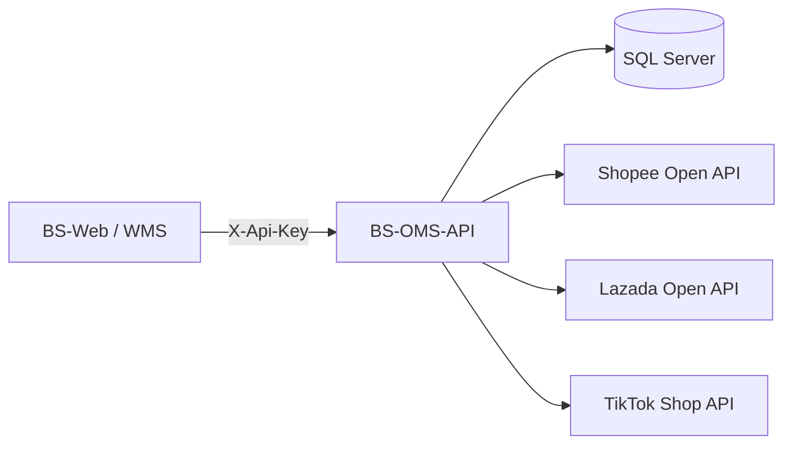
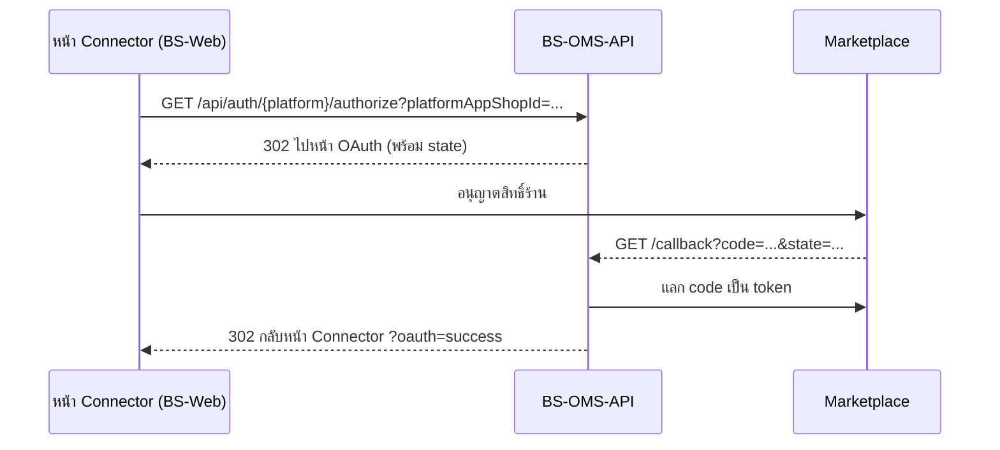
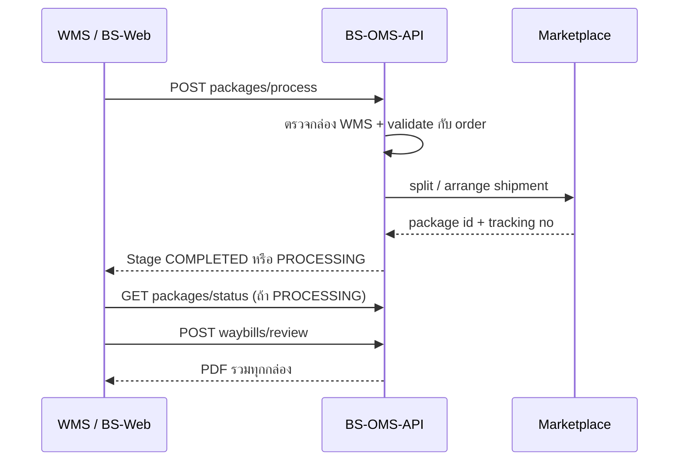

# BS-OMS-API — API Documentation

เอกสารประกอบการใช้งาน API ระบบ Order Management System สำหรับ Shopee, Lazada และ TikTok Shop

| เวอร์ชันเอกสาร | วันที่ | API Version | Source |
| --- | --- | --- | --- |
| 1.2 | 6 ตุลาคม 2026 | v1 (.NET 9) | OMS / BS-OMS-API (origin/main 9c6a51e) |

### ประวัติการแก้ไข

| เวอร์ชัน | วันที่ | รายละเอียด |
| --- | --- | --- |
| 1.2 | 06/10/2026 | เพิ่ม Webhook API 3 เส้น, OAuth ใช้ Connector (`platformAppShopId` + `state`) และ callback redirect กลับหน้า Connector, App Key/Secret ย้ายไปเก็บในตาราง `oms.t_oms_platform_apps`, refresh ต้องส่ง `shopId`, Data Protection ต้องตั้งค่าบังคับ |
| 1.1 | 29/09/2026 | ไม่ต้องส่ง `accessToken` ทุก endpoint (ใช้ credential ที่ OMS เก็บไว้ และ refresh อัตโนมัติ), `/order/all` และ `/products/all` ไม่บังคับ `platformCredentials`, เพิ่มตาราง `oms.t_oms_sync_log` และ audit columns |
| 1.0 | 24/09/2026 | ฉบับแรก จัดทำจาก source code ของ BS-OMS-API |

## สารบัญ

1. [ภาพรวมระบบ](#1-ภาพรวมระบบ)
2. [Authentication](#2-authentication)
3. [รูปแบบ Request และ Response](#3-รูปแบบ-request-และ-response)
4. [สรุป Endpoint ทั้งหมด](#4-สรุป-endpoint-ทั้งหมด)
5. [Auth API](#5-auth-api)
6. [Order API](#6-order-api)
7. [Inventory API](#7-inventory-api)
8. [Shipping API](#8-shipping-api)
9. [Webhook API](#9-webhook-api)
10. [Shop และ Chat API](#10-shop-และ-chat-api)
11. [Data Models](#11-data-models)
12. [การตั้งค่าและการ Deploy](#12-การตั้งค่าและการ-deploy)
13. [ข้อสังเกตจากการตรวจโค้ด](#13-ข้อสังเกตจากการตรวจโค้ด)

---

## 1. ภาพรวมระบบ

BS-OMS-API เป็น REST API กลางที่รวมคำสั่งซื้อ สต็อก และการจัดส่งของ **Shopee, Lazada และ TikTok Shop** ไว้ใน interface เดียว ระบบอื่น เช่น BS-Web และ WMS เรียก API นี้แทนการเรียก Marketplace โดยตรง

### 1.1 ข้อมูลทั่วไป

| หัวข้อ | รายละเอียด |
| --- | --- |
| Framework | ASP.NET Core Web API, .NET 9 |
| Database | SQL Server ผ่าน EF Core 9 (เปิดใช้เมื่อตั้ง `OMS_DB_CONNECTION_STRING`) |
| API Docs | Swagger UI ที่ `/swagger` (path `/` redirect ไป Swagger) |
| Local URL | `https://localhost:53954`, `http://localhost:53955` |
| Docker | container port 8080 → host port 8182 |
| IIS | รองรับ virtual path เช่น `/WM3_OMS` |
| Platform ที่รองรับ | `Shopee`, `Lazada`, `TikTok` (enum `PlatformType`) |

### 1.2 สถาปัตยกรรม



1. Client (BS-Web / WMS) ส่ง HTTP request พร้อม header `X-Api-Key`
2. CORS policy และ `ApiKeyMiddleware` ตรวจสอบ origin และ API Key
3. Controller ตรวจ parameter แล้วเรียก Service (`OrderService`, `InventoryService`, `ShippingService` ฯลฯ)
4. `PlatformClientFactory` เลือก `ShopeeClient`, `LazadaClient` หรือ `TikTokClient` ซึ่งเซ็น request ด้วย HMAC-SHA256
5. Platform client เรียก Marketplace API แล้วแปลงผลเป็นโมเดลกลาง (เช่น `UnifiedOrder`)
6. Token และข้อมูล order / package / waybill ถูกเก็บใน SQL Server

### 1.3 โครงสร้างโปรเจกต์

| โฟลเดอร์ / ไฟล์ | หน้าที่ |
| --- | --- |
| `Controllers/` | Auth, Order, Inventory, Shipping, Shop, Chat |
| `Services/` | Business logic และ platform clients (Shopee, Lazada, TikTok) |
| `Models/` | DTO แยกตาม Auth, Common, Orders, Inventory, Shipping, Persistence |
| `Middleware/ApiKeyMiddleware.cs` | ตรวจสอบ API Key |
| `Extensions/` | `ApplicationDbContext` และ `PlatformShopIdResolver` |
| `Database/`, `Migrations/` | SQL script และ EF Core migrations |
| `OmsApi.Tests/` | Unit tests (xUnit) |

---

## 2. Authentication

### 2.1 API Key

ทุก request ต้องส่ง header `X-Api-Key` ที่ตรงกับค่า `OMS_API_KEY` ของเซิร์ฟเวอร์ การเทียบเป็นแบบ case-sensitive

```http
GET /api/order/shopee/240924ABCDEF?shopId=123456 HTTP/1.1
Host: localhost:53954
X-Api-Key: <your-api-key>
Content-Type: application/json
```

> **Dev mode:** ถ้าไม่ได้ตั้ง `OMS_API_KEY` ระบบจะอนุญาตทุก request โดยไม่ตรวจ API Key ต้องตั้งค่านี้ทุกครั้งบน environment จริง

API Key ไม่ถูกหรือไม่มี จะได้ `401 Unauthorized`:

```json
{
  "success": false,
  "message": "Unauthorized: Invalid or missing API key. Include 'X-Api-Key' header."
}
```

### 2.2 Path ที่ไม่ต้องใช้ API Key

- `/swagger/*`, `/scalar/*`, `/openapi/*`
- `/api/auth/{platform}/authorize`, `/api/auth/{platform}/auth-url`, `/api/auth/{platform}/callback` (เปิดจาก browser ระหว่างทำ OAuth)
- `/api/webhooks/*` (Marketplace เรียกเข้ามา ตรวจสอบด้วยลายเซ็น HMAC ใน header `Authorization` แทน)

### 2.3 การเชื่อมร้านค้า (OAuth กับ Marketplace)

การเชื่อมร้านเริ่มจากหน้า **Connector** ใน BS-Web ซึ่งบันทึก App Master และร้านไว้ในฐานข้อมูลก่อน (ดู 2.5) OMS-API เก็บ access/refresh token ของแต่ละร้านแบบเข้ารหัสไว้ในตาราง `oms.t_oms_platform_credential`



1. ผู้ดูแลกดเชื่อมร้านจากหน้า Connector ระบบเปิด `GET /api/auth/{platform}/authorize?platformAppShopId={id}`
2. OMS-API อ่าน App Key/Secret ของ Connector นั้นจากฐานข้อมูล สร้าง `state` ที่เซ็นแล้ว (อายุ 10 นาที) และ redirect (302) ไปหน้าอนุญาตสิทธิ์ของ Marketplace
3. ผู้ดูแลล็อกอินและอนุญาตสิทธิ์ร้าน
4. Marketplace redirect กลับมาที่ `/api/auth/{platform}/callback?code=...&state=...` (Shopee ส่ง `shop_id` และฝาก `state` ไว้ใน redirect URL เพราะ Shopee ไม่มี parameter state)
5. OMS-API ตรวจ `state` แลก code เป็น token บันทึกแบบเข้ารหัส แล้ว redirect กลับหน้า Connector พร้อม `?oauth=success` หรือ `?oauth=error`

### 2.4 การใช้ token ของ Marketplace

ตั้งแต่เวอร์ชันนี้ทุก endpoint ใช้ token ที่ OMS เก็บไว้ในตาราง `oms.t_oms_platform_credential` client **ไม่ต้องส่ง `accessToken`** อีกต่อไป ส่งแค่ `platform` และ `shopId`

1. OMS หา credential ที่ `is_active = YES` และ `requires_reauthorization = NO` ของ platform และ shop ที่ระบุ
2. ถ้า access token จะหมดอายุภายใน 2 นาที OMS refresh ให้อัตโนมัติก่อนเรียก Marketplace
3. ถ้า Marketplace ปฏิเสธ token ระหว่างเรียก OMS refresh แล้วลองใหม่ 1 ครั้ง
4. ถ้า refresh token หมดอายุหรือไม่มี OMS ตั้ง `requires_reauthorization = YES` และต้องเชื่อมร้านใหม่ผ่าน OAuth

> **ส่ง shopId เมื่อไหร่:** ถ้า platform เดียวกันมีร้านที่ active มากกว่า 1 ร้าน ต้องส่ง `shopId` มิฉะนั้นจะได้ error `SHOP_ID_REQUIRED` ถ้ามีร้านเดียวไม่ต้องส่ง

| Error code | สาเหตุ | วิธีแก้ |
| --- | --- | --- |
| `CREDENTIAL_NOT_FOUND` | ไม่พบ credential ที่ active ของร้านนั้น | เชื่อมร้านผ่าน OAuth หรือเปิด active ใน Connector |
| `SHOP_ID_REQUIRED` | มีหลายร้านใน platform เดียวกันแต่ไม่ได้ส่ง `shopId` | ส่ง `shopId` |
| `REAUTHORIZATION_REQUIRED` | refresh token หมดอายุ หรือร้านถูกตั้งให้เชื่อมใหม่ | ทำ OAuth ใหม่ (`/api/auth/{platform}/authorize`) |
| `CREDENTIAL_DECRYPT_FAILED` | ถอดรหัส token ไม่ได้ (Data Protection key เปลี่ยนหรือหาย) | ตรวจ `OMS_DATA_PROTECTION_KEYS_PATH` แล้วเชื่อมร้านใหม่ |

Error เหล่านี้กลับมาใน `message` โดย Order คืน 500, Inventory คืน 500 และ Shipping คืน 400

ค่า `{platform}` ใน path ใช้ `shopee`, `lazada`, `tiktok` (ไม่สนตัวพิมพ์เล็ก-ใหญ่)

### 2.5 App Master และ Connector

ตั้งแต่ v1.2 ค่า App Key, App Secret, Redirect URL และ Service ID ของแต่ละ Marketplace **ไม่ได้อ่านจาก** `.env` **แล้ว** แต่อ่านจากฐานข้อมูล ซึ่งจัดการผ่านหน้า Connector ของ BS-Web (BS-API-Core เป็นผู้บันทึก และเข้ารหัสด้วย Data Protection key ชุดเดียวกับ OMS-API)

| ตาราง | เก็บอะไร |
| --- | --- |
| `oms.t_oms_platform_apps` | App Master: `platform`, `app_name`, `app_key_encrypted`, `app_secret_encrypted`, `redirect_url`, `service_id`, `is_active` |
| `oms.t_oms_platform_app_shops` | Connector: จับคู่ร้าน (`platform`, `shop_id`, `shop_name`) กับ App Master ผ่าน `platform_app_id` ค่า `platform_app_shop_id` คือ `platformAppShopId` ที่ใช้เริ่ม OAuth |

> **ข้อควรระวัง:** Connector หรือ App Master ที่ `is_active = NO` ใช้เริ่ม OAuth ไม่ได้ (400) และถ้าถอดรหัส App Key/Secret ไม่ได้จะได้ 400 `Connector app credential could not be decrypted or is incomplete.`

---

## 3. รูปแบบ Request และ Response

### 3.1 Response มาตรฐาน

ทุก endpoint ตอบกลับเป็น JSON ห่อด้วย `ApiResponse<T>` (ชื่อ field เป็น camelCase) ยกเว้น endpoint ที่คืนไฟล์ PDF และ OAuth redirect

```json
{
  "success": true,
  "message": "Retrieved 50 orders from Shopee",
  "data": { },
  "totalCount": 120
}
```

| Field | Type | ความหมาย |
| --- | --- | --- |
| `success` | bool | `true` = สำเร็จ |
| `message` | string | ข้อความผลลัพธ์หรือ error |
| `data` | T \| null | ข้อมูลผลลัพธ์ (เป็น `null` เมื่อ error) |
| `totalCount` | int \| null | จำนวนทั้งหมด (เฉพาะ endpoint แบบ list) |

### 3.2 Pagination

Endpoint แบบแบ่งหน้ารับ `page` (เริ่มที่ 1) และ `pageSize` (default 50) แล้วคืน `data` เป็น `PaginatedResult<T>`:

```json
{ "items": [ ], "totalCount": 120, "page": 1, "pageSize": 50, "hasMore": true }
```

### 3.3 ค่า Enum

โปรเจกต์ไม่ได้ตั้ง `JsonStringEnumConverter` ดังนั้น enum ใน JSON body และ response เป็น**ตัวเลข** ส่วนใน path/query ใช้ชื่อได้

| PlatformType | ค่าใน JSON |
| --- | --- |
| Shopee | `0` |
| Lazada | `1` |
| TikTok | `2` |

### 3.4 HTTP Status Codes

| Code | เมื่อไหร่ |
| --- | --- |
| 200 | สำเร็จ |
| 302 | OAuth redirect (`/authorize`) |
| 400 | Parameter ไม่ครบหรือไม่ถูกต้อง, platform ไม่รองรับ, Marketplace ปฏิเสธ |
| 401 | API Key ไม่ถูกหรือไม่มี |
| 404 | ไม่พบ order / product / package / waybill |
| 413 | Webhook body ใหญ่เกิน 1 MB |
| 500 | Error ภายใน (`message` = `Internal error: ...`) |
| 501 | Endpoint ที่ยังไม่ implement (Chat) |
| 503 | Document service ไม่พร้อม หรือ Webhook ยังไม่ได้ตั้ง secret / บันทึกไม่สำเร็จ |

### 3.5 Error จาก Marketplace

เมื่อ Marketplace ปฏิเสธ (`PlatformApiException`) API จะคืน 400 และ `message` มีรูปแบบ:

```text
{Platform} API error '{code}': {message} (request_id: {requestId})
```

---

## 4. สรุป Endpoint ทั้งหมด

API มี 38 endpoint ใน 7 controller ทุก path ขึ้นต้นด้วย `/api` ส่วน Shop และ Chat ยังเป็น placeholder

| กลุ่ม | Method | Path | หน้าที่ |
| --- | --- | --- | --- |
| Auth | GET | `/api/auth/{platform}/authorize` | Redirect ไปหน้า OAuth |
| Auth | GET | `/api/auth/{platform}/auth-url` | คืน URL OAuth |
| Auth | GET | `/api/auth/{platform}/callback` | รับ code และบันทึก token |
| Auth | POST | `/api/auth/{platform}/refresh` | Refresh access token |
| Auth | POST | `/api/auth/sandbox-token` | Import token Sandbox (Dev/ST) |
| Order | POST | `/api/order/list` | Order จาก 1 platform |
| Order | POST | `/api/order/all` | Order จากหลาย platform |
| Order | GET | `/api/order/{platform}/{orderId}` | รายละเอียด Order |
| Order | GET | `/api/order/{platform}/{orderId}/status` | สถานะ Order และ deadline |
| Order | POST | `/api/order/cancellation-deadlines` | Order ใกล้หมดเขตส่ง |
| Inventory | POST | `/api/inventory/products` | สินค้าจาก 1 platform |
| Inventory | POST | `/api/inventory/products/all` | สินค้าจากหลาย platform |
| Inventory | GET | `/api/inventory/{platform}/{itemId}` | รายละเอียดสินค้าและสต็อก |
| Inventory | POST | `/api/inventory/low-stock` | สินค้าสต็อกต่ำ |
| Inventory | POST | `/api/inventory/update-stock` | อัปเดตสต็อก |
| Shipping | GET | `/api/shipping/wms-packages/{customerOrderNumber}` | อ่านกล่องจาก WMS |
| Shipping | POST | `/api/shipping/packages/process` | ประมวลผลกล่อง WMS จนได้ Tracking |
| Shipping | GET | `/api/shipping/packages/status/{platform}/{orderId}` | สถานะ PROCESSING / COMPLETED |
| Shipping | GET | `/api/shipping/packages/{platform}/{orderId}` | Package ที่บันทึกไว้ |
| Shipping | POST | `/api/shipping/packages/sync` | บันทึก Package/Tracking เข้า OMS/WMS |
| Shipping | POST | `/api/shipping/packages/sync-from-platform` | ดึง Tracking จาก platform แล้วบันทึก |
| Shipping | POST | `/api/shipping/waybills/ensure` | สร้าง/ตรวจ Waybill |
| Shipping | GET | `/api/shipping/waybills/{platform}/{orderId}` | สถานะ Waybill |
| Shipping | GET | `/api/shipping/waybills/{platform}/{orderId}/file` | ดาวน์โหลด PDF Waybill |
| Shipping | POST | `/api/shipping/waybills/review` | รวม Waybill เป็น PDF เดียว |
| Shipping | POST | `/api/shipping/print-label` | ใบปะหน้า 1 Order |
| Shipping | POST | `/api/shipping/print-labels-batch` | ใบปะหน้าหลาย Order |
| Shipping | POST | `/api/shipping/arrange` | Arrange shipment |
| Shipping | GET | `/api/shipping/tracking/{platform}/{orderId}` | ติดตามพัสดุ |
| Shipping | GET | `/api/shipping/providers/{platform}` | รายการผู้ให้บริการขนส่ง |
| Shipping | GET | `/api/shipping/test-connection/{platform}` | ทดสอบ credential |
| Webhook | POST | `/api/webhooks/shopee` | รับ Push Mechanism จาก Shopee |
| Webhook | POST | `/api/webhooks/lazada` | รับ Message Service จาก Lazada |
| Webhook | POST | `/api/webhooks/tiktok` | รับ Event จาก TikTok Shop |
| Shop | GET | `/api/shop` | ร้านที่เชื่อม (placeholder) |
| Chat | GET | `/api/chat/conversations` | 501 Not implemented |
| Chat | GET | `/api/chat/conversations/{id}/messages` | 501 Not implemented |
| Chat | POST | `/api/chat/conversations/{id}/send` | 501 Not implemented |

---

## 5. Auth API

### 5.1 Redirect ไปหน้า OAuth

**`GET /api/auth/{platform}/authorize`**

Redirect (302) ไปหน้าอนุญาตสิทธิ์ของ Marketplace ใช้เปิดจาก browser ไม่ต้องใช้ API Key

| Parameter | In | Type | จำเป็น | คำอธิบาย |
| --- | --- | --- | --- | --- |
| platform | path | string | ใช่ | `shopee`, `lazada`, `tiktok` |
| platformAppShopId | query | long | ใช่ | รหัส Connector (`oms.t_oms_platform_app_shops.platform_app_shop_id`) |

คืน 400 เมื่อ platform ไม่รองรับ, ไม่พบ Connector, Connector/App Master ไม่ active หรือถอดรหัส App Key ไม่ได้

### 5.2 ขอ URL OAuth

**`GET /api/auth/{platform}/auth-url`**

คืน URL สำหรับหน้า OAuth โดยไม่ redirect parameter เหมือน 5.1 (ต้องมี `platformAppShopId`)

```json
{ "success": true, "message": "Success", "data": { "url": "https://partner.shopeemobile.com/..." } }
```

### 5.3 OAuth Callback

**`GET /api/auth/{platform}/callback`**

Marketplace เรียกกลับมาหลังผู้ใช้อนุญาตสิทธิ์ OMS ตรวจ state แลก code เป็น token บันทึกแบบเข้ารหัส แล้ว redirect กลับหน้า Connector

| Parameter | In | Type | จำเป็น | คำอธิบาย |
| --- | --- | --- | --- | --- |
| platform | path | string | ใช่ | `shopee`, `lazada`, `tiktok` |
| code | query | string | ใช่ | Authorization code (ไม่มี = ล้มเหลว) |
| state | query | string | ใช่ | state ที่ OMS สร้างตอน authorize (อายุ 10 นาที) |
| shop_id | query | string | Shopee | ต้องตรงกับร้านของ Connector |
| error | query | string | ไม่ | Marketplace ส่งมาเมื่อผู้ใช้ปฏิเสธ |

ไม่คืน JSON แล้ว แต่ redirect (302) ไปที่ `OMS_FRONTEND_CONNECTOR_URL` พร้อม query บอกผล:

```http
HTTP/1.1 302 Found
Location: https://<bs-web>/master/connector?oauth=success&platform=shopee
```

> **ถ้าไม่ได้ตั้ง `OMS_FRONTEND_CONNECTOR_URL`** หรือ URL ไม่ใช่ https (นอก Development) จะได้ 500 `{"success": false, "message": "OAuth return URL is not configured."}`

### 5.4 Refresh Token

**`POST /api/auth/{platform}/refresh`**

ขอ access token ใหม่ด้วย refresh token คืน `TokenInfo` ตั้งแต่ v1.2 **ต้องส่ง** `shopId` เพื่อหา Connector ของร้าน (ไม่มี หรือไม่พบ Connector คืน 400)

```json
{
  "refreshToken": "<refresh-token>",
  "shopId": "123456"
}
```

### 5.5 Import Sandbox Token

**`POST /api/auth/sandbox-token`**

บันทึก token จากเครื่องมือ Sandbox ของ Marketplace แบบเข้ารหัส

> **เงื่อนไขการใช้งาน:** ใช้ได้เมื่อ environment เป็น Development หรือ Staging หรือตั้ง `OMS_ENABLE_SANDBOX_TOKEN_IMPORT=YES` มิฉะนั้นคืน 404

```json
{
  "platform": "shopee",
  "accessToken": "<token>",
  "refreshToken": "<token>",
  "shopId": "123456",
  "shopName": "Test Shop",
  "expiresInSeconds": 14400,
  "refreshExpiresInSeconds": 2592000
}
```

| Field | Type | จำเป็น | เงื่อนไข |
| --- | --- | --- | --- |
| `platform` | string | ใช่ | ไม่เกิน 32 ตัวอักษร |
| `accessToken` | string | ใช่ | ไม่เกิน 2,048 ตัวอักษร |
| `refreshToken` | string | ไม่ | ไม่เกิน 2,048 ตัวอักษร |
| `shopId` | string | ใช่ | ไม่เกิน 128 ตัวอักษร |
| `expiresInSeconds` | int | ไม่ | 60 – 2,592,000 |
| `refreshExpiresInSeconds` | int | ไม่ | 60 – 7,776,000 |

---

## 6. Order API

### 6.1 ดึง Order จาก 1 Platform

**`POST /api/order/list`**

ดึง Order แบบแบ่งหน้าจาก platform ที่ระบุ คืน `PaginatedResult<UnifiedOrder>` และบันทึก Order ลง `oms.t_oms_order` พร้อม log ใน `oms.t_oms_sync_log`

| Field (OrderFilter) | Type | จำเป็น | คำอธิบาย |
| --- | --- | --- | --- |
| `platform` | int | ใช่ | `PlatformType` |
| `shopId` | string | บางกรณี | จำเป็นเมื่อ platform นั้นมีหลายร้านที่ active |
| `status` | int | ไม่ | `OrderStatus` (ดูหัวข้อ 11.2) |
| `dateFrom`, `dateTo` | datetime | ไม่ | ช่วงวันที่สร้าง Order |
| `page`, `pageSize` | int | ไม่ | default 1 และ 50 |

```json
{
  "platform": 0,
  "shopId": "123456",
  "status": 2,
  "dateFrom": "2026-09-01T00:00:00Z",
  "dateTo": "2026-09-24T00:00:00Z",
  "page": 1,
  "pageSize": 50
}
```

### 6.2 ดึง Order จากหลาย Platform

**`POST /api/order/all`**

ดึง Order จากหลายร้านพร้อมกัน (parallel) โดยใช้ credential ที่ OMS เก็บไว้ คืน `List<UnifiedOrder>` เรียงตามเวลาสร้างล่าสุด

`platformCredentials` ไม่บังคับแล้ว ถ้าไม่ส่ง ระบบดึงจากทุกร้านที่ active ถ้าส่ง ใช้เป็นตัวเลือก `platform` + `shopId` เท่านั้น ไม่มี `accessToken`

```json
{
  "status": 2,
  "platformCredentials": [
    { "platform": 0, "shopId": "123456" },
    { "platform": 1, "shopId": "100001" }
  ]
}
```

ดึงจากทุกร้านที่ active:

```json
{ "status": 2 }
```

> **ถ้ามี platform ใด error:** ระบบจะ log ไว้และคืน list ว่างพร้อม 200 (ไม่ใช่ผลบางส่วน) ถ้าไม่มีร้านที่ active เลยจะได้ `CREDENTIAL_NOT_FOUND`

### 6.3 รายละเอียด Order

**`GET /api/order/{platform}/{orderId}`**

ดูรายละเอียด Order รวม items, shipping, tax invoice และ buyer remarks คืน `UnifiedOrder` ไม่พบคืน 404

| Parameter | In | Type | จำเป็น | คำอธิบาย |
| --- | --- | --- | --- | --- |
| platform | path | string | ใช่ | `shopee`, `lazada`, `tiktok` |
| orderId | path | string | ใช่ | เลข Order ของ Marketplace |
| shopId | query | string | บางกรณี | จำเป็นเมื่อ platform นั้นมีหลายร้านที่ active |

### 6.4 สถานะ Order

**`GET /api/order/{platform}/{orderId}/status`**

เช็คสถานะ Order และเส้นตายการจัดส่ง parameter เหมือน 6.3

```json
{
  "orderId": "240924ABCDEF",
  "platform": 0,
  "status": 2,
  "statusName": "ReadyToShip",
  "originalStatus": "READY_TO_SHIP",
  "cancellationDeadline": "2026-09-26T10:00:00Z",
  "daysUntilCancellation": 1,
  "isUrgent": true
}
```

`isUrgent` เป็น `true` เมื่อเหลือเวลาไม่เกิน 1 วัน

### 6.5 Order ใกล้หมดเขตส่ง

**`POST /api/order/cancellation-deadlines?daysThreshold=2`**

body = `OrderFilter` คืน Order ที่เหลือเวลาส่งไม่เกิน `daysThreshold` วัน (default 2)

---

## 7. Inventory API

### 7.1 รายการสินค้าจาก 1 Platform

**`POST /api/inventory/products`**

ดึงรายการสินค้าพร้อมสต็อก คืน `PaginatedResult<ProductItem>` ต้องระบุ `platform`

| Field (ProductFilter) | Type | จำเป็น | คำอธิบาย |
| --- | --- | --- | --- |
| `platform` | int | ใช่ | `PlatformType` |
| `shopId` | string | บางกรณี | จำเป็นเมื่อ platform นั้นมีหลายร้านที่ active |
| `keyword` | string | ไม่ | คำค้นชื่อสินค้า |
| `itemStatus` | string | ไม่ | สถานะสินค้าของ platform |
| `page`, `pageSize` | int | ไม่ | default 1 และ 50 |

```json
{ "platform": 1, "shopId": "100001", "keyword": "shirt", "itemStatus": "NORMAL", "page": 1, "pageSize": 50 }
```

### 7.2 สินค้าจากหลาย Platform

**`POST /api/inventory/products/all`**

body = `ProductFilter` คืน `List<ProductItem>` ถ้าไม่ส่ง `platformCredentials` จะดึงจากทุกร้านที่ active

### 7.3 รายละเอียดสินค้า

**`GET /api/inventory/{platform}/{itemId}`**

ดูรายละเอียดสินค้าและสต็อก ไม่พบคืน 404

| Parameter | In | Type | จำเป็น | คำอธิบาย |
| --- | --- | --- | --- | --- |
| platform | path | string | ใช่ | `Shopee`, `Lazada`, `TikTok` หรือ 0–2 |
| itemId | path | string | ใช่ | รหัสสินค้า |
| shopId | query | string | บางกรณี | จำเป็นเมื่อ platform นั้นมีหลายร้านที่ active |

### 7.4 สินค้าสต็อกต่ำ

**`POST /api/inventory/low-stock?threshold=5`**

body = `ProductFilter` คืนสินค้าที่สต็อกไม่เกิน `threshold` (default 5)

### 7.5 อัปเดตสต็อก

**`POST /api/inventory/update-stock`**

ตั้งจำนวนสต็อกใหม่ของสินค้าหรือ variation สำเร็จคืน 200 ล้มเหลวคืน 400

```json
{
  "platform": 0,
  "shopId": "123456",
  "itemId": "100200300",
  "variationId": "555",
  "newStock": 20
}
```

---

## 8. Shipping API

ทุก endpoint ในกลุ่มนี้ใช้ token ที่ OMS เก็บไว้ ส่งแค่ `platform`, `shopId` และเลข Order

### 8.1 ลำดับการทำงานกับ WMS



1. WMS เรียก `POST /api/shipping/packages/process`
2. OMS ตรวจกล่อง WMS และ validate กับ Order ของ Marketplace
3. OMS split order (ถ้ามีหลายกล่อง) และ arrange shipment กับ Marketplace
4. Marketplace คืน package id และ tracking number แล้ว OMS บันทึกกลับ OMS/WMS
5. OMS ตอบ `stage` = `COMPLETED` หรือ `PROCESSING`
6. ถ้าได้ `PROCESSING` ให้เรียก `packages/process` ซ้ำ หรืออ่าน `packages/status` จนได้ `COMPLETED`
7. WMS เรียก `POST /api/shipping/waybills/review` เพื่อรับ PDF Waybill รวมทุกกล่อง

### 8.2 อ่านกล่องจาก WMS

**`GET /api/shipping/wms-packages/{customerOrderNumber}`**

อ่านกล่องและสินค้าในกล่องจาก WMS คืน `WmsPackageManifest` ไม่พบหรือพบซ้ำหลาย order คืน 404

| Parameter | In | Type | จำเป็น | คำอธิบาย |
| --- | --- | --- | --- | --- |
| customerOrderNumber | path | string | ใช่ | เลข Customer Order ใน WMS |
| platform | query | enum | ไม่ | กรองตาม platform |

`data` มี `customerOrderNumber`, `outboundOrderNumber`, `outboundOrderMasterId` และ `packages[]` (`wmsPackageRef`, `boxNumber`, `isCloseBox`, `trackingNumber`, `totalWeight`, `boxSize`, `items[]`)

### 8.3 ประมวลผลกล่อง WMS

**`POST /api/shipping/packages/process`**

ประมวลผลแบบ end-to-end ตั้งแต่ตรวจกล่อง จนบันทึก Tracking กลับ OMS/WMS

```json
{
  "platform": 0,
  "shopId": "123456",
  "platformOrderId": "240924ABCDEF",
  "customerOrderNumber": "SO-2609-0001"
}
```

> **เงื่อนไขที่คืน 400**
> - ไม่มีกล่อง หรือ `wmsPackageRef` ว่าง/ซ้ำ
> - `boxNumber` ไม่เกิน 0 หรือซ้ำ
> - มีกล่องที่ `isCloseBox` ไม่ใช่ `YES`
> - กล่องว่าง หรือมีสินค้าจำนวนไม่เกิน 0
> - Marketplace ปฏิเสธคำขอ

Response `data` (`ProcessPlatformPackagesResult`):

```json
{
  "platform": 0,
  "shopId": "123456",
  "platformOrderId": "240924ABCDEF",
  "customerOrderNumber": "SO-2609-0001",
  "stage": "COMPLETED",
  "totalBoxes": 2,
  "packages": [
    {
      "platformPackageRecordId": 101,
      "wmsPackageRef": "3f1c...",
      "boxNumber": 1,
      "itemCount": 2,
      "totalQuantity": 5,
      "platformPackageId": "OFG123",
      "trackingNumber": "TH0123456789",
      "waybillRequired": true,
      "status": "READY",
      "error": null
    }
  ]
}
```

### 8.4 สถานะการประมวลผล

**`GET /api/shipping/packages/status/{platform}/{orderId}?shopId=`**

อ่านสถานะจาก OMS โดยไม่เรียก Marketplace ไม่เคย process คืน 404 `stage` เป็น `COMPLETED` เมื่อทุกกล่องมี package id, tracking number ไม่ซ้ำกัน และ Waybill เป็น `READY` (เฉพาะกล่องที่ต้องมี Waybill)

### 8.5 Package ที่บันทึกไว้

**`GET /api/shipping/packages/{platform}/{orderId}?shopId=`**

`shopId` จำเป็น คืน `List<PlatformPackageRecordResult>` แต่ละรายการมี `boxNumber`, `platformPackageId`, `trackingNumber`, `shippingProviderId`, `shippingProviderName`, `packageStatus`, `syncStatus`, `error`

### 8.6 บันทึกผล Package

**`POST /api/shipping/packages/sync`**

ให้ WMS หรือ integration job บันทึกผล package กลับเข้ากล่อง WMS เอง คืน `SyncPlatformPackagesResult` (`totalPackages`, `succeededPackages`, `failedPackages`, `packages[]`)

```json
{
  "platform": 2,
  "shopId": "7000001",
  "platformOrderId": "5770000000001",
  "customerOrderNumber": "SO-2609-0002",
  "persistTrackingToWms": true,
  "packages": [
    {
      "wmsPackageRef": "3f1c...",
      "boxNumber": 1,
      "platformPackageId": "1150000001",
      "trackingNumber": "TT0001",
      "shippingProviderName": "J&T",
      "packageStatus": "READY",
      "items": [ { "platformSkuId": "1729", "itemNumber": "SKU-001", "quantity": 2 } ]
    }
  ]
}
```

### 8.7 ดึง Tracking จาก Platform

**`POST /api/shipping/packages/sync-from-platform`**

ดึง Tracking จาก Marketplace แล้วบันทึกลงกล่อง WMS

| Field | จำเป็น | คำอธิบาย |
| --- | --- | --- |
| `platform` | ใช่ | `PlatformType` |
| `shopId` | ไม่ | Shop ID |
| `platformOrderId` | ใช่ | เลข Order ของ Marketplace |
| `customerOrderNumber` | ใช่ | เลข Customer Order ใน WMS |
| `packageMappings[]` | split order | `wmsPackageRef` + `platformPackageId` ครบทุก package |
| `persistTrackingToWms` | ไม่ | default `true` |

### 8.8 สร้างหรือตรวจ Waybill

**`POST /api/shipping/waybills/ensure`**

สร้างหรือตรวจ Waybill ของ package ที่บันทึกไว้ คืน `List<PlatformDocumentResult>` (`platformPackageId`, `trackingNumber`, `documentType`, `documentStatus` เช่น `READY`, `fileName`, `fileSize`, `error`)

```json
{
  "platform": 1,
  "shopId": "100001",
  "platformOrderId": "880000001",
  "shippingDocumentType": "NORMAL_AIR_WAYBILL"
}
```

> **Lazada ส่งเอง:** Package ของ Lazada ที่ใช้ seller own fleet หรือ seller own tracking ไม่ต้องมี Waybill ระบบจะคืน list ว่าง

### 8.9 สถานะ Waybill

**`GET /api/shipping/waybills/{platform}/{orderId}?shopId=`**

อ่านสถานะ Waybill ที่ OMS บันทึกไว้

### 8.10 ดาวน์โหลด Waybill

**`GET /api/shipping/waybills/{platform}/{orderId}/file`**

คืนไฟล์ PDF โดยตรง (ไม่ห่อด้วย `ApiResponse`) ยังไม่พร้อมคืน 404

| Parameter | In | Type | จำเป็น | คำอธิบาย |
| --- | --- | --- | --- | --- |
| shopId | query | string | ใช่ | Shop ID |
| packageId | query | string | ไม่ | Package ของ Marketplace |
| markPrinted | query | bool | ไม่ | `true` = นับว่าพิมพ์แล้ว (default `false`) |

### 8.11 รวม Waybill เป็น PDF เดียว

**`POST /api/shipping/waybills/review`**

รวม Waybill ของกล่องที่เลือกเป็นไฟล์ `{orderId}-waybills.pdf` และบันทึกว่าพิมพ์แล้ว คืน 400 เมื่อมีกล่องที่ไม่ใช่ของ Order นี้ หรือ Waybill ยังไม่ `READY` ครบ

```json
{
  "platform": 0,
  "shopId": "123456",
  "platformOrderId": "240924ABCDEF",
  "wmsPackageRefs": [ "3f1c...", "8a2d..." ]
}
```

### 8.12 ใบปะหน้าพัสดุ

**`POST /api/shipping/print-label`**

ขอใบปะหน้า (Shipping Label / AWB) ของ 1 Order สร้างไม่ได้คืน 404

| Field | จำเป็น | คำอธิบาย |
| --- | --- | --- |
| `platform` | ใช่ | `PlatformType` |
| `shopId` | ไม่ | Shop ID |
| `orderId` | ใช่ | เลข Order |
| `packageId` | ไม่ | Package ID (TikTok) |
| `trackingNumber` | ไม่ | เลข Tracking |
| `documentType` | ไม่ | default `NORMAL_AIR_WAYBILL` |

Response `ShippingLabelResult` มี `trackingNumber`, `documentUrl` หรือ `documentBase64`, `contentType`, `status`, `carrier`

**`POST /api/shipping/print-labels-batch`** — ขอใบปะหน้าหลาย Order พร้อมกัน body เป็น array ของ `ShippingLabelRequest`

### 8.13 Arrange Shipment

**`POST /api/shipping/arrange`**

Arrange shipment ทีละ Order `shippingMethod` รับ `pickup`, `dropoff` (default) หรือ `non_integrated`

```json
{
  "platform": 0,
  "shopId": "123456",
  "orderId": "240924ABCDEF",
  "packageId": null,
  "shippingMethod": "dropoff",
  "trackingNumber": null,
  "shippingProviderId": null
}
```

### 8.14 ติดตามพัสดุ

**`GET /api/shipping/tracking/{platform}/{orderId}?shopId=`**

คืน `TrackingInfo` (`trackingNumber`, `carrier`, `status`, `events[]`, `packages[]`) ใช้ credential ที่ OMS เก็บไว้เท่านั้น ไม่รับ token ใน URL

### 8.15 ผู้ให้บริการขนส่ง

**`GET /api/shipping/providers/{platform}?shopId=`**

คืน `List<ShippingProvider>` (`providerId`, `name`, `platform`, `enabled`)

### 8.16 ทดสอบการเชื่อมต่อ

**`GET /api/shipping/test-connection/{platform}?shopId=`**

ทดสอบ credential ที่เก็บไว้โดยไม่เปิดเผย token คืน 200 เสมอ ให้ดูผลที่ `data.connected` — `data` มี `connected`, `credentialFound`, `shopId`, `shippingProviderCount`, `message`, `errorCode`, `requestId`, `checkedAtUtc`

---

## 9. Webhook API

Marketplace แจ้งเหตุการณ์ของ Order มาที่ OMS ทันทีโดยไม่ต้องรอ polling ทั้ง 3 เส้นไม่ใช้ `X-Api-Key` แต่ตรวจลายเซ็น HMAC-SHA256 จาก header `Authorization` โดยคำนวณจาก raw body ที่ได้รับ

| Method | Path | ที่มา |
| --- | --- | --- |
| POST | `/api/webhooks/shopee` | Shopee Push Mechanism |
| POST | `/api/webhooks/lazada` | Lazada Message Service |
| POST | `/api/webhooks/tiktok` | TikTok Shop event notification |

### 9.1 การตรวจลายเซ็น

| Platform | ข้อความที่เซ็น | HMAC key |
| --- | --- | --- |
| Shopee | callback URL ที่ลงทะเบียน + raw body | `SHOPEE_WEBHOOK_SECRET` หรือ `SHOPEE_PARTNER_KEY` (ทดสอบ: `SHOPEE_TEST_PUSH_KEY`) |
| Lazada | `LAZADA_APP_KEY` + raw body | `LAZADA_WEBHOOK_SECRET` หรือ `LAZADA_APP_SECRET` |
| TikTok | `TIKTOK_APP_KEY` + raw body | `TIKTOK_WEBHOOK_SECRET` หรือ `TIKTOK_APP_SECRET` |

callback URL มาจาก `{PLATFORM}_WEBHOOK_URL` หรือ `OMS_PUBLIC_BASE_URL` + `/api/webhooks/{platform}` ต้องตรงกับ URL ที่ลงทะเบียนใน console ทุกตัวอักษร

### 9.2 Request และ Response

```http
POST /api/webhooks/shopee HTTP/1.1
Content-Type: application/json
Authorization: <hex HMAC-SHA256>

{
  "code": 3,
  "shop_id": 1274495,
  "timestamp": 1660124246,
  "data": {
    "ordersn": "220810QXVJM3EX",
    "status": "READY_TO_SHIP",
    "update_time": 1660124246
  }
}
```

Response 200:

```json
{
  "accepted": true,
  "duplicate": false,
  "eventId": 1024,
  "message": "Webhook accepted."
}
```

| Code | เมื่อไหร่ |
| --- | --- |
| 200 | รับแล้ว (รวมถึงกรณีส่งซ้ำ `duplicate: true`) |
| 400 | body ว่าง, ไม่ใช่ JSON หรือข้อมูลไม่ครบ |
| 401 | ลายเซ็นไม่ถูกต้อง |
| 413 | body ใหญ่เกิน 1 MB |
| 503 | ยังไม่ได้ตั้ง secret หรือบันทึก event ไม่สำเร็จ |

### 9.3 การประมวลผล

1. บันทึก event (ตัด token/secret ออก) ลง `oms.t_oms_webhook_event` โดยใช้ `event_key` กันรับซ้ำ แล้วตอบ 200 ทันที
2. Background worker ดึง Order Detail จาก Marketplace แล้ว upsert ลง `oms.t_oms_order`
3. ดึง order list ของร้านย้อนหลัง `WEBHOOK_ORDER_LIST_LOOKBACK_HOURS` ชั่วโมง (default 24, สูงสุด 5 หน้า × 50) ร้านเดียวกันภายใน 30 วินาทีรวมเป็นครั้งเดียว
4. event ที่ค้างหรือ FAILED ถูกหยิบมาทำใหม่ตอน service start

| Platform | Event ที่รองรับ |
| --- | --- |
| Shopee | code 3 สถานะ Order, 4 Tracking, 5, 8, 15 (เมื่อมีเลข Order) · code 2 ยกเลิกสิทธิ์ร้าน = ปิด credential และต้องเชื่อมใหม่ · code 1, 12 บันทึกไว้ตรวจสอบ |
| Lazada | `message_type` 0 Trade Order (รวม reverse order), 14 Fulfillment Order Update |
| TikTok | topic ที่เปิดใน Partner Center ที่มีเลข Order เก็บเป็น `TIKTOK_<type>` ถ้ามีแค่ package id จะเป็น `IGNORED` |

สถานะใน `processing_status`: `RECEIVED`, `QUEUED`, `PROCESSING`, `PROCESSED`, `FAILED`, `IGNORED`, `DUPLICATE` · Order TikTok ที่ `ON_HOLD` จะ arrange shipment ไม่ได้จนกว่าสถานะจะเปลี่ยน

---

## 10. Shop และ Chat API

ทั้งสองกลุ่มยังเป็น placeholder และยังไม่ได้เชื่อมกับข้อมูลจริง

| Method | Path | ผลลัพธ์ |
| --- | --- | --- |
| GET | `/api/shop` | คืนรายการ 3 platform ที่ `connected` = `false` เสมอ |
| GET | `/api/chat/conversations` | 501 Not Implemented |
| GET | `/api/chat/conversations/{conversationId}/messages` | 501 Not Implemented |
| POST | `/api/chat/conversations/{conversationId}/send` | 501 Not Implemented |

---

## 11. Data Models

### 11.1 UnifiedOrder

โมเดลกลางที่แปลง Order ของทุก Marketplace ให้อยู่ในรูปแบบเดียวกัน

| Field | Type | ความหมาย |
| --- | --- | --- |
| `orderId` | string | เลข Order ของ Marketplace |
| `platform` | int | `PlatformType` |
| `status` | int | `OrderStatus` |
| `originalStatus` | string | สถานะเดิมจาก Marketplace |
| `buyerName`, `buyerRemarks` | string | ผู้ซื้อและหมายเหตุ |
| `taxInvoiceRequested` | bool | ขอใบกำกับภาษีหรือไม่ |
| `taxInvoice` | object | `taxId`, `companyName`, `address`, `branchCode` |
| `cancellationDeadline` | datetime | เส้นตายส่งก่อนถูกยกเลิก |
| `daysUntilCancellation` | int | จำนวนวันที่เหลือ (คำนวณจาก UTC) |
| `createdAt`, `updatedAt` | datetime | เวลาสร้าง / แก้ไข |
| `totalAmount`, `currency` | decimal, string | ยอดรวม (default `THB`) |
| `shipping` | object | `carrier`, `trackingNumber`, `packageNumber`, `shippingMethod`, `shippingFee`, `estimatedDeliveryDate`, `recipientAddress` |
| `packages` | array | `ShippingPackage` เมื่อ Order แยกหลายกล่อง |
| `items` | array | `OrderItem` (ดู 11.3) |
| `shopName` | string | ชื่อร้าน |

`recipientAddress` มี `name`, `phone`, `addressLine1`, `addressLine2`, `subDistrict`, `district`, `province`, `postalCode`, `country`, `fullAddress`

### 11.2 OrderStatus

| ค่า | ชื่อ | Shopee | Lazada | TikTok |
| --- | --- | --- | --- | --- |
| 0 | Unpaid | UNPAID | unpaid | UNPAID |
| 1 | Pending | INVOICE_PENDING | pending | ON_HOLD |
| 2 | ReadyToShip | READY_TO_SHIP, PROCESSED | ready_to_ship, packed | AWAITING_SHIPMENT, AWAITING_COLLECTION |
| 3 | Shipped | SHIPPED | shipped | PARTIALLY_SHIPPING, IN_TRANSIT |
| 4 | Delivered | — | delivered | DELIVERED |
| 5 | Completed | COMPLETED | — | COMPLETED |
| 6 | Cancelled | CANCELLED | canceled, failed | CANCELLED |
| 7 | ReturnRefund | IN_CANCEL | returned | REVERSE |
| 8 | Unknown | อื่น ๆ | อื่น ๆ | อื่น ๆ |

### 11.3 OrderItem

| Field | Type | ความหมาย |
| --- | --- | --- |
| `itemId`, `modelId`, `orderItemId` | string, long | รหัสสินค้า / model / รายการใน Order |
| `sku`, `name`, `variation` | string | SKU ชื่อ และตัวเลือกสินค้า |
| `quantity` | int | จำนวน |
| `unitPrice`, `totalPrice`, `discount` | decimal | ราคาต่อหน่วย ราคารวม ส่วนลด |
| `weight` | decimal | น้ำหนัก |

### 11.4 ProductItem

| Field | Type | ความหมาย |
| --- | --- | --- |
| `itemId`, `platform` | string, int | รหัสสินค้าและ platform |
| `name`, `sku`, `status`, `imageUrl` | string | ข้อมูลสินค้า |
| `price`, `currency` | decimal, string | ราคา (default `THB`) |
| `stock` | object | `currentStock`, `reservedStock`, `availableStock` |
| `variations[]` | array | `variationId`, `variationName`, `sku`, `price`, `currentStock` |
| `totalStock` | int | สต็อกรวม |
| `createdAt`, `updatedAt` | datetime | เวลาสร้าง / แก้ไข |

### 11.5 ตารางฐานข้อมูล

| ตาราง | เก็บอะไร | Key หลัก |
| --- | --- | --- |
| `oms.t_oms_platform_credential` | Token แบบเข้ารหัสต่อร้าน | unique (platform, shop_id) |
| `oms.t_oms_platform_apps` | App Master: App Key/Secret แบบเข้ารหัส, redirect URL (ใหม่ใน v1.2) | unique (platform, app_name) |
| `oms.t_oms_platform_app_shops` | Connector: จับคู่ร้านกับ App Master (ใหม่ใน v1.2) | unique (platform, shop_id) |
| `oms.t_oms_order` | Header Order ที่ sync มา | platform, shop_id, platform_order_id |
| `oms.t_oms_order_item` | รายการสินค้าของ Order | order_record_id |
| `oms.t_oms_platform_package` | กล่อง WMS ↔ package ของ Marketplace | outbound_sort_master_id |
| `oms.t_oms_platform_package_item` | สินค้าในแต่ละ package | platform_package_record_id |
| `oms.t_oms_platform_document` | Metadata Waybill (สถานะ ไฟล์ จำนวนครั้งที่พิมพ์) | platform_order_id, platform_package_id |
| `oms.t_oms_sync_log` | Log การ sync Order ทุกครั้ง: sync_source, sync_status, total_fetched, duration_ms, request_payload, error_message | sync_log_id |
| `oms.t_oms_sync_log_detail` | ผลราย Order ของแต่ละรอบ sync: action, old_status, new_status | sync_log_id |
| `oms.t_oms_webhook_event` | Webhook ที่รับเข้ามา (ใหม่ใน v1.2): event_type, platform_order_id, processing_status, attempt_count, error_message | unique (event_key) |
| `dbo.t_wms_outbound_master` | Outbound Order ของ WMS (อ่านอย่างเดียว) | customer_order_number |
| `dbo.t_wms_outbound_packing_master` | กล่อง WMS (เขียน tracking กลับ) | outbound_sort_master_id |
| `dbo.t_wms_outbound_packing_detail` | สินค้าในกล่อง WMS | outbound_sort_master_id |

ตาราง `dbo.t_wms_*` เป็นของ WMS และไม่อยู่ใน EF migration ทุกตาราง `oms.*` ใช้ audit columns ชุดเดียวกัน: `create_by`, `create_date`, `update_by`, `update_date`

---

## 12. การตั้งค่าและการ Deploy

### 12.1 Environment Variables

ค่าตั้งมาจาก environment variable หรือไฟล์ `.env` ใน content root ของแอป (รองรับ IIS) ยกเว้น App Key/Secret และ Redirect URL สำหรับ OAuth ซึ่งย้ายไปอยู่ในตาราง App Master แล้ว (ดู 2.5)

| Variable | จำเป็น | ความหมาย |
| --- | --- | --- |
| `OMS_API_KEY` | แนะนำ | API Key สำหรับ header `X-Api-Key` (ว่าง = ไม่ตรวจ) |
| `OMS_DB_CONNECTION_STRING` | ใช่ | SQL Server connection string |
| `OMS_DATA_PROTECTION_KEYS_PATH` | ใช่ | โฟลเดอร์ key ring ที่ใช้ร่วมกับ BS-API-Core (ไม่ตั้ง = แอป start ไม่ขึ้น) |
| `OMS_DATA_PROTECTION_APP_NAME` | ใช่ | ต้องตรงกับ BS-API-Core (ไม่ตั้ง = แอป start ไม่ขึ้น) |
| `OMS_FRONTEND_CONNECTOR_URL` | ใช่ | หน้า Connector ของ BS-Web ที่ callback redirect กลับไป (https) |
| `OMS_PUBLIC_BASE_URL` | Webhook | URL สาธารณะของ OMS ใช้ประกอบ callback URL ของ webhook |
| `SHOPEE_WEBHOOK_URL`, `LAZADA_WEBHOOK_URL`, `TIKTOK_WEBHOOK_URL` | ไม่ | ระบุ callback URL ของ webhook ตรง ๆ (แทน `OMS_PUBLIC_BASE_URL`) |
| `SHOPEE_WEBHOOK_SECRET`, `LAZADA_WEBHOOK_SECRET`, `TIKTOK_WEBHOOK_SECRET` | ไม่ | secret สำหรับตรวจลายเซ็น webhook (ไม่ตั้ง = ใช้ Partner Key / App Secret) |
| `SHOPEE_TEST_PUSH_KEY` | ไม่ | key ทดสอบ Push ของ Shopee |
| `WEBHOOK_ORDER_LIST_LOOKBACK_HOURS` | ไม่ | ช่วงย้อนหลังที่ดึง order list หลังรับ webhook (default 24) |
| `OMS_ENABLE_SANDBOX_TOKEN_IMPORT` | ไม่ | `YES` = เปิด sandbox-token นอก Dev/Staging |
| `CORS_ALLOWED_ORIGINS` | ไม่ | คั่นด้วย `,` (default localhost:3000, 5173, 8080) |
| `WAYBILL_STORAGE_ROOT` | ไม่ | โฟลเดอร์เก็บไฟล์ Waybill |
| `SHOPEE_PARTNER_KEY` | Webhook | ใช้ตรวจลายเซ็น webhook เท่านั้น (OAuth ใช้ค่าจาก App Master) |
| `SHOPEE_API_URL` | ไม่ | default `https://partner.shopeemobile.com` |
| `SHOPEE_SENDER_REAL_NAME` | ไม่ | ชื่อผู้ส่งตอน arrange |
| `LAZADA_APP_KEY`, `LAZADA_APP_SECRET` | Webhook | ใช้ตรวจลายเซ็น webhook เท่านั้น (OAuth ใช้ค่าจาก App Master) |
| `LAZADA_API_URL`, `LAZADA_AUTH_URL`, `LAZADA_AUTH_API_URL` | ไม่ | default `https://api.lazada.co.th/rest` |
| `LAZADA_SHIPPING_PROVIDER_ID`, `LAZADA_SHIPPING_PROVIDER_CODE`, `LAZADA_SHIPPING_ALLOCATE_TYPE` | ไม่ | ค่าขนส่งตอน pack |
| `TIKTOK_APP_KEY`, `TIKTOK_APP_SECRET` | Webhook | ใช้ตรวจลายเซ็น webhook และ Sandbox import (OAuth ใช้ค่าจาก App Master) |
| `TIKTOK_API_URL`, `TIKTOK_AUTH_URL`, `TIKTOK_AUTH_API_URL` | ไม่ | default `https://open-api.tiktokglobalshop.com` |
| `TIKTOK_ALLOW_ITEM_LEVEL_SPLIT` | ไม่ | อนุญาต split ระดับ item |

> **Redirect URL:** ตั้งที่ App Master (`redirect_url`) ต้องชี้มาที่ `/api/auth/{platform}/callback` และลงทะเบียนไว้ใน console ของแต่ละ Marketplace ค่า `SHOPEE_REDIRECT_URL`, `LAZADA_REDIRECT_URL`, `TIKTOK_REDIRECT_URL`, `SHOPEE_PARTNER_ID` และ `TIKTOK_SERVICE_ID` ใน `.env` ไม่ถูกใช้แล้ว

> **Data Protection Keys:** OMS-API และ BS-API-Core ต้องใช้ key ring เดียวกัน (`OMS_DATA_PROTECTION_KEYS_PATH` + `OMS_DATA_PROTECTION_APP_NAME`) เพราะ BS-API-Core เข้ารหัส App Key และ OMS-API ถอดรหัส ถ้า key หาย token และ App Key ทั้งหมดจะถอดรหัสไม่ได้

### 12.2 รันแบบ Local

```bash
cd BS-OMS-API/OmsApi
dotnet run
```

จากนั้นเปิด `https://localhost:53954/swagger`

### 12.3 รันด้วย Docker

Service `bs_oms_api` ใน `docker-compose.yml` ที่ root ของ repo map port `8182:8080` เปิดใช้งานที่ `http://localhost:8182/swagger`

```bash
docker compose up -d --build bs_oms_api
```

### 12.4 Database Migration

สร้างตาราง schema `oms` ด้วย EF migration (`InitialCreate`, `AddPlatformOrderTables`, `LinkPlatformPackageToOrder`, `StandardizeAuditColumns`, `AddPlatformSyncLogTables`, `AddPlatformSyncLog`, `ShrinkSyncLogRequestPayload`, `AddPlatformWebhookEvents`):

```bash
dotnet ef database update --project BS-OMS-API/OmsApi
```

ตาราง App Master และ Connector ไม่อยู่ใน EF migration ต้องรัน `Database/002_Create_PlatformApps.sql` แยก

---

## 13. ข้อสังเกตจากการตรวจโค้ด

รายการที่พบระหว่างจัดทำเอกสาร และควรแก้ก่อนใช้งานจริง

| # | ประเด็น | ผลกระทบ | แนวทางแก้ |
| --- | --- | --- | --- |
| 1 | `docker-compose.yml` ไม่มี `OMS_DB_CONNECTION_STRING`, `OMS_DATA_PROTECTION_*`, `OMS_FRONTEND_CONNECTOR_URL` (ตอนนี้พึ่งค่าจาก `.env` ที่ติดไปกับ image) | ถ้า `.env` ใน image ไม่มีค่า Data Protection แอปจะ start ไม่ขึ้น และ OAuth callback คืน 500 | กำหนดค่าใน compose หรือ secret store ให้ชัดเจน |
| 2 | OAuth อ่าน App Key/Secret จากฐานข้อมูล แต่ตรวจลายเซ็น Webhook ยังอ่านจาก `.env` | ถ้าเปลี่ยน App ใน Connector แต่ไม่แก้ `.env` webhook จะได้ 401 ทั้งหมด | ให้ webhook อ่าน secret จาก App Master เดียวกัน |
| 3 | `POST /api/order/all` ถ้าร้านใดร้านหนึ่ง error จะคืน list ว่างทั้งหมดพร้อม 200 | Client เข้าใจผิดว่าไม่มี Order | คืนผลของร้านที่สำเร็จ พร้อมรายการร้านที่ error |
| 4 | ตาราง App Master/Connector สร้างจาก `Database/002_Create_PlatformApps.sql` ไม่อยู่ใน EF migration และมี script เลข `002` ซ้ำ 2 ไฟล์ ส่วน script อื่นยังใช้ชื่อ `dbo.t_interface_platform_*` | ฐานข้อมูลใหม่ที่สร้างด้วย `dotnet ef` จะไม่มีตาราง App Master ทำให้ OAuth ใช้ไม่ได้ | ย้ายเข้า EF migration และจัดเลข script ใหม่ |
| 5 | Enum ใน JSON เป็นตัวเลข | Client ต้องจำค่าตัวเลข อ่านยาก | พิจารณาเพิ่ม `JsonStringEnumConverter` |
| 6 | Shop และ Chat ยังเป็น placeholder | ยังไม่มีข้อมูลจริง | ระบุใน roadmap |
